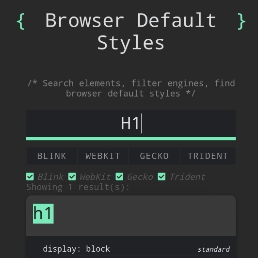

```meta-bind
INPUT[TAGS-Tiny-Tools][:tags]
```

___
Search against any element for standardized and default styles from all major rendering engines (WebKit, Blink, Gecko, Trident)
___



```cardlink
url: https://browserdefaultstyles.com
title: "Browser Default Styles"
description: "Search against any element for standardized and default styles from all major rendering engines (WebKit, Blink, Gecko, Trident)."
host: browserdefaultstyles.com
favicon: icons/favicon-32x32.png
image: https://browserdefaultstyles.com/icons/twitter-image-card-600x314.jpg
```
