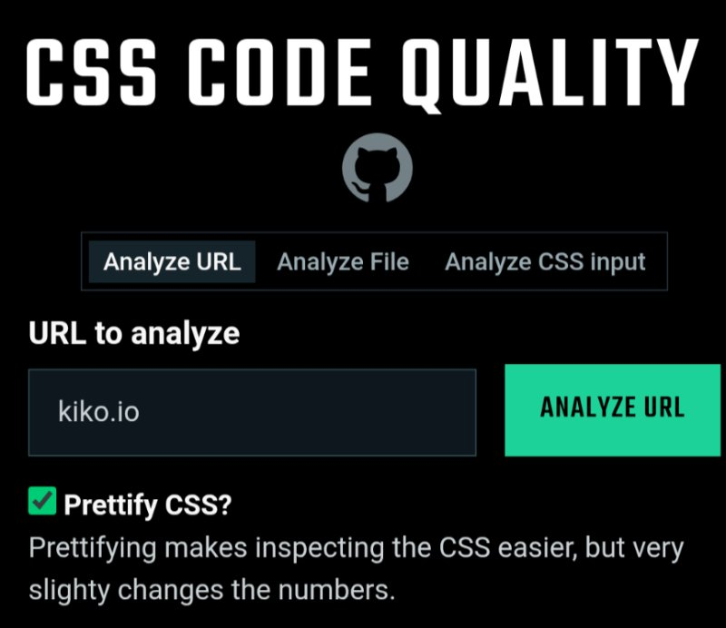

```meta-bind
INPUT[TAGS-Tiny-Tools][:tags]
```

___
The best way to analyze your CSS is to use the [CSS analyzer](https://www.projectwallace.com/analyze-css), but if you're in a hurry or if you want an opinionated tool, then you can use this CSS Code Quality analyzer.
___

```cardlink
url: https://www.projectwallace.com/css-code-quality
title: "Online CSS Code Quality Analyzer - Project Wallace"
description: "This online analyzer takes your CSS and tells you exactly which areas should be improved."
host: www.projectwallace.com
favicon: https://www.projectwallace.com/favicon.png
image: https://www.projectwallace.com/_app/immutable/assets/og-image.BLkbbWKp.png
```


