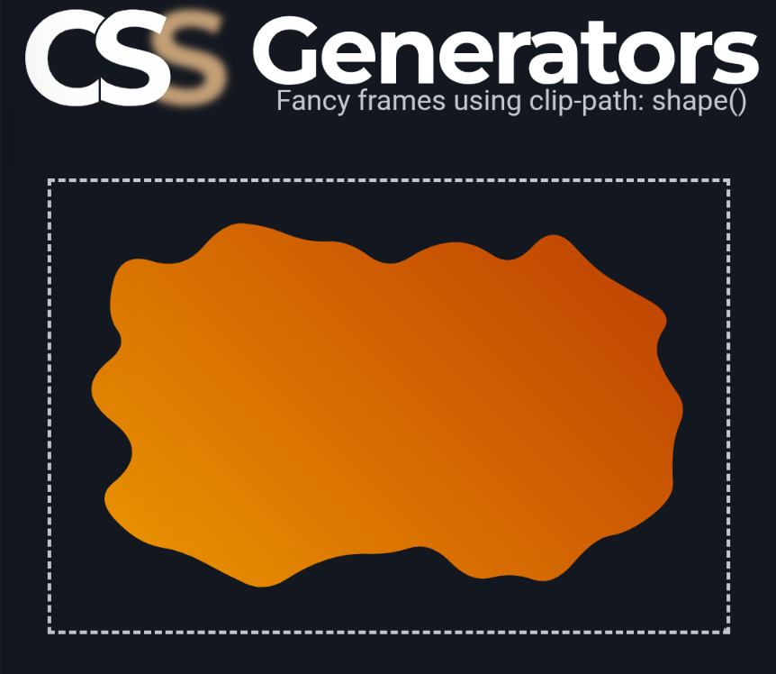

```meta-bind
INPUT[TAGS-Tiny-Tools][:tags]
```

___
Use clip-path: shape() to create a lot of CSS-only fancy frames. Get an optimized & modern code in no time.
___



```cardlink
url: https://css-generators.com/fancy-frame/
title: "CSS Generator for Fancy Frames (Squiggly, Ragged, Wavy, Torn, etc.)"
description: "Use clip-path: shape() to create a lot of CSS-only fancy frames. Get an optimized & modern code in no time."
host: css-generators.com
favicon: fav.png
image: https://css-generators.com/fancy-frame/fancy-frame.jpg
```

