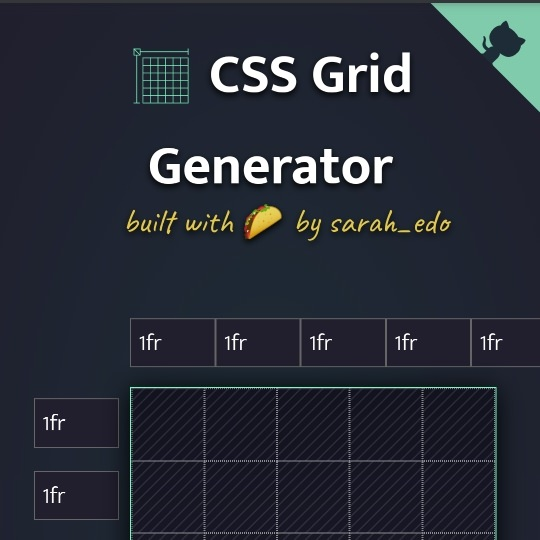

```meta-bind
INPUT[TAGS-Tiny-Tools][:tags]
```

___
You can set the numbers, and units of your columns and rows, and I'll generate a CSS grid for you! Drag within the boxes to create divs placed within the grid.
___


