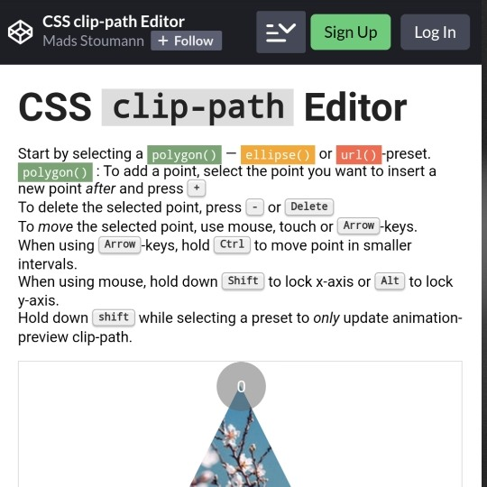

```meta-bind
INPUT[TAGS-Tiny-Tools][:tags]
```

___
Generate clip-path CSS code, based on editable templates.
___



```cardlink
url: https://codepen.io/stoumann/full/abZxoOM
title: "CSS clip-path Editor"
description: "..."
host: codepen.io
favicon: https://cpwebassets.codepen.io/assets/favicon/favicon-aec34940fbc1a6e787974dcd360f2c6b63348d4b1f4e06c77743096d55480f33.ico
image: https://shots.codepen.io/username/pen/abZxoOM-800.jpg?version=1627934602
```
