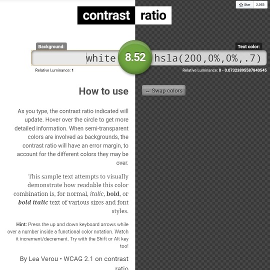

```meta-bind
INPUT[TAGS-Tiny-Tools][:tags]
```

___
Easily calculate color contrast ratios.
___



```cardlink
url: https://contrast-ratio.com/
title: "Contrast Ratio - WCAG Color Contrast Checker"
description: "Check the contrast ratio between your website’s background and font colors with our free interactive tool based on WCAG guidelines."
host: contrast-ratio.com
favicon: https://www.siegemedia.com/wp-content/uploads/2025/06/sm-favicon.svg
```
