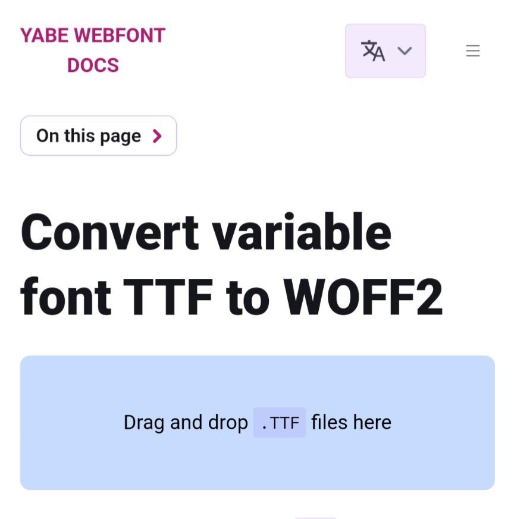

```meta-bind
INPUT[TAGS-Tiny-Tools][:tags]
```

___
Google Fonts f.e. sometimes only offers TTF files, but the compressed WOFF2 Webfonts are smaller for using on website. This tool converts them easily.
___


