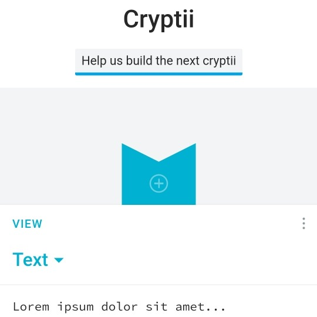

```meta-bind
INPUT[TAGS-Tiny-Tools][:tags]
```

___
Web app offering modular conversion, encoding and encryption online.
___



```cardlink
url: https://cryptii.com/pipes/unicode-lookup
title: "Unicode lookup: Online code point lookup tool"
description: "In encoding standards like ASCII and Unicode each character can be represented by a numeric code point. While ASCII is limited to 128 characters, Unicode has a much wider array of characters and has begun to supplant ASCII rapidly."
host: cryptii.com
image: https://cdn.wierk.net/projects/cryptii-com/assets/images/og-cryptii-default.png
```
