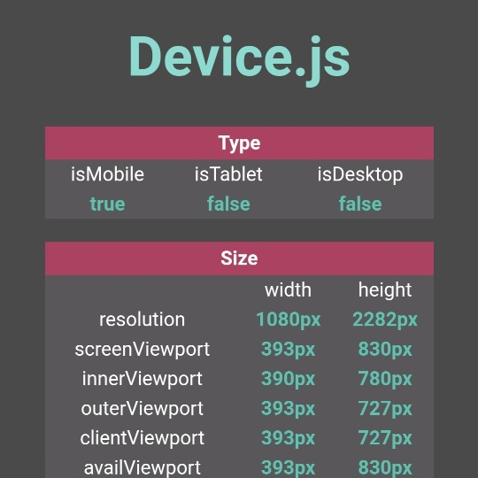

```meta-bind
INPUT[TAGS-Tiny-Tools][:tags]
```

___
Helpy small tool, to get some device features, such as the different widths, heights, orientation, full screen, mobile or desktop, height of the navigation bar, etc.
___


