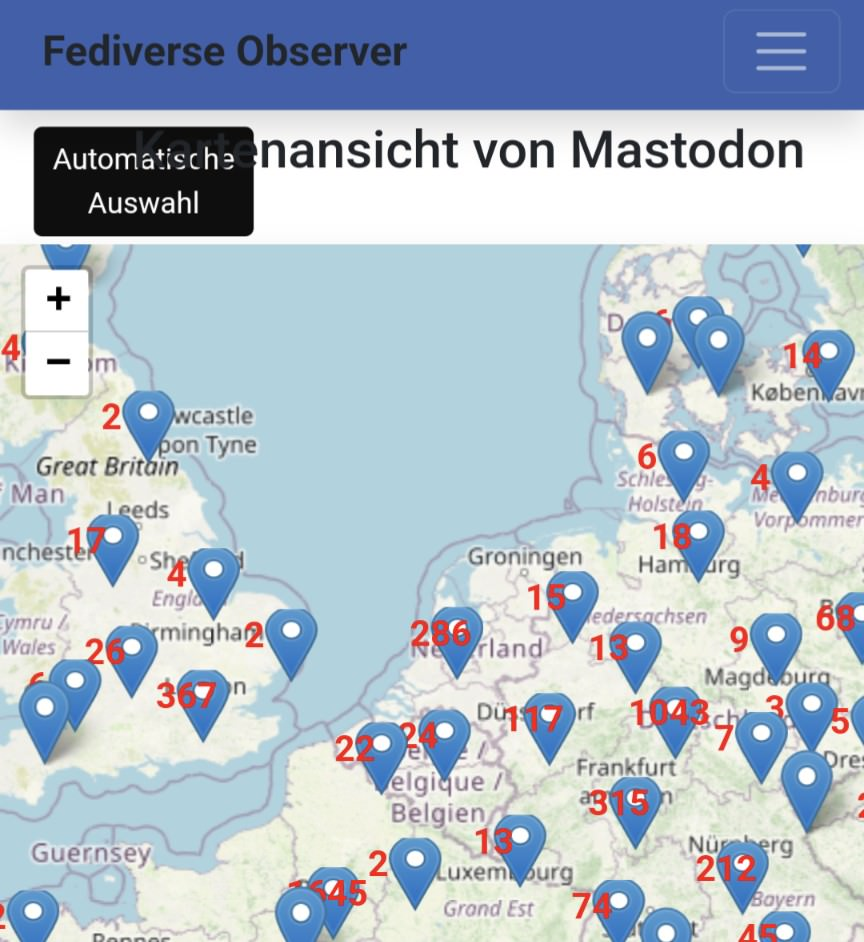

```meta-bind
INPUT[TAGS-Tiny-Tools][:tags]
```

___
Fediverse Observer checks all servers in the Fediverse and offers you an easy way to find a home using a map or list
___



```cardlink
url: https://mastodon.fediverse.observer/map
title: "Fediverse Observer checks all sites in the fediverse and gives you an easy way to find a home from a map or list or automatically."
description: "Mastodon Sites Status. Find a Mastodon server to sign up for, find one close to you!"
host: mastodon.fediverse.observer
favicon: https://cdn.fediverse.observer/app/assets/favicon.ico
```
