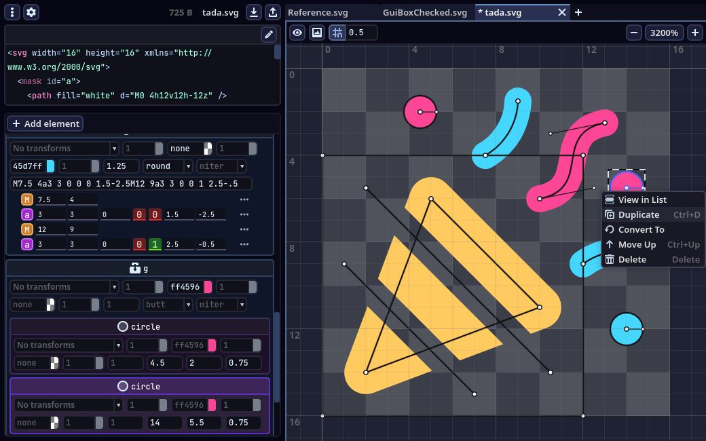

```meta-bind
INPUT[TAGS-Tiny-Tools][:tags]
```

___
GodSVG is a free, open-source, low-level vector graphics editor, available on all major desktop platforms
___



```cardlink
url: https://www.godsvg.com/
title: "GodSVG - Free and Open Source SVG editor"
description: "GodSVG is a free, open-source, low-level vector graphics editor, available on all major desktop platforms"
host: www.godsvg.com
favicon: https://godsvg.com/assets/favicon.ico
image: https://godsvg.com/assets/favicon.ico
```
