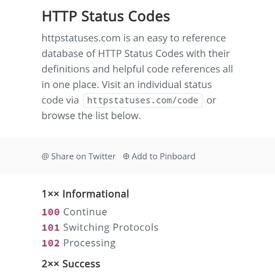

```meta-bind
INPUT[TAGS-Tiny-Tools][:tags]
```

___
HTTP Status Code directory, with definitions, details and helpful code references.
___



```cardlink
url: https://httpstatuses.com/
title: "HTTP Status Codes Glossary"
description: "Wondering what an HTTP status code means? Browse this list of HTTP status codes for definitions and code references."
host: httpstatuses.com
favicon: https://www.webfx.com/wp-content/uploads/2021/10/favicon.png
image: https://www.webfx.com/wp-content/uploads/2024/10/webfx-fallback-img.png
```
