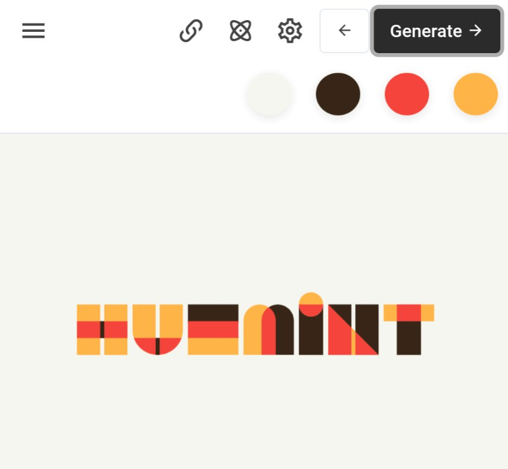

```meta-bind
INPUT[TAGS-Tiny-Tools][:tags]
```

___
Huemint uses machine learning to create unique color schemes for your brand, website or graphic
___



```cardlink
url: https://huemint.com
title: "Huemint - AI color palette generator"
host: huemint.com
favicon: https://huemint.com/assets/img/logo-32.png
```
