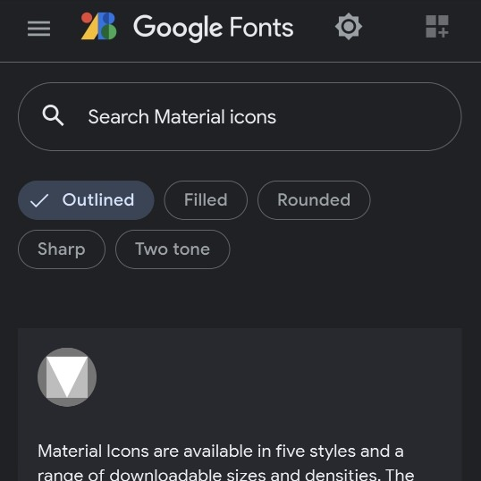

```meta-bind
INPUT[TAGS-Tiny-Tools][:tags]
```

___
Material Icons are available in five styles and a range of downloadable sizes and densities. The icons are based on the core Material Design principles and metrics.
___



```cardlink
url: https://fonts.google.com/icons
title: "Material Symbols and Icons - Google Fonts"
description: "Material Symbols are our newest icons consolidating over 2,500 glyphs in a single font file with a wide range of design variants."
host: fonts.google.com
favicon: https://www.gstatic.com/images/icons/material/apps/fonts/1x/catalog/v5/favicon.svg
image: https://www.gstatic.com/images/icons/material/apps/fonts/1x/material-symbols/material_symbols.jpg
```
