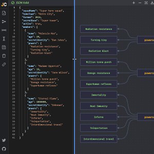

```meta-bind
INPUT[TAGS-Tiny-Tools][:tags]
```

___
JSON editor with graph visualization
___



```cardlink
url: https://jsoncrack.com/editor
title: "Editor | JSON Crack"
description: "JSON Crack Editor is a tool for visualizing into graphs, analyzing, editing, formatting, querying, transforming and validating JSON, CSV, YAML, XML, and more."
host: jsoncrack.com
favicon: https://jsoncrack.com/favicon.ico
image: https://jsoncrack.com/assets/jsoncrack.png
```
