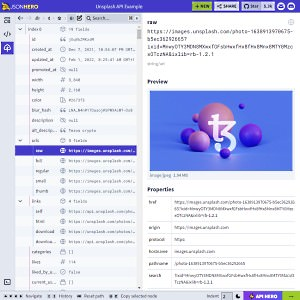

```meta-bind
INPUT[TAGS-Tiny-Tools][:tags]
```

___
Open-Source JSON explorer for the web that lets you browse, search and navigate your JSON files at speed.
___



```cardlink
url: https://jsonhero.io
title: "JSON Hero - A beautiful JSON viewer"
description: "JSON Hero makes reading and understand JSON files easy by giving you a clean and beautiful UI packed with extra features."
host: jsonhero.io
image: https://jsonhero.io/build/_assets/opengraph-P6EWTI3J.png
```
