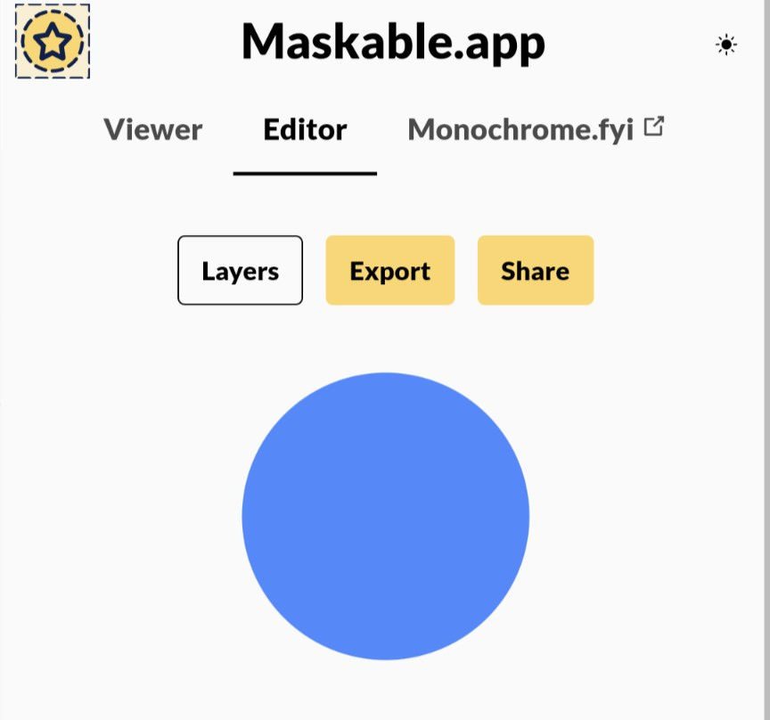

```meta-bind
INPUT[TAGS-Tiny-Tools][:tags]
```

___
Maskable.app Editor lets you generate maskable PWA icons before adding them to your web app manifest.
___



```cardlink
url: https://maskable.app/editor
title: "Maskable.app Editor"
description: "Preview maskable icons in the browser!"
host: maskable.app
favicon: favicon/favicon_16.png
```
