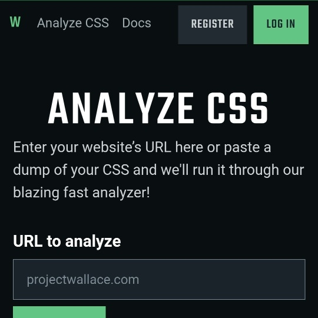

```meta-bind
INPUT[TAGS-Tiny-Tools][:tags]
```

___
Analyze CSS is an online tool that analyzes your website’s CSS
___



```cardlink
url: https://www.projectwallace.com/analyze-css
title: "Online CSS Analyzer - Project Wallace"
description: "Analyze your website's CSS in this fast, detailed analyzer. Enter a URL of paste in your raw CSS and get near-instant analysis."
host: www.projectwallace.com
favicon: https://www.projectwallace.com/favicon.png
image: https://www.projectwallace.com/_app/immutable/assets/og-image.B5cj2aJV.png
```
