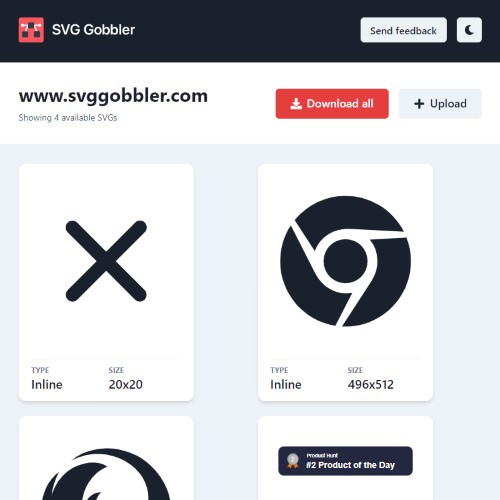

```meta-bind
INPUT[TAGS-Tiny-Tools][:tags]
```

___
Download icons, logos, and vector SVGs from any site via Chrome or Firefox extension
___



```cardlink
url: https://www.svggobbler.com/
title: "SVG Gobbler - Find, optimize, organize, edit, and export SVGs like never before"
description: "SVG Gobbler is a browser extension for finding, optimizing, organizing, editing, and exporting SVGs like never before."
host: www.svggobbler.com
favicon: https://www.svggobbler.com/favicon.ico
image: https://svggobbler.com/og-image.png
```
