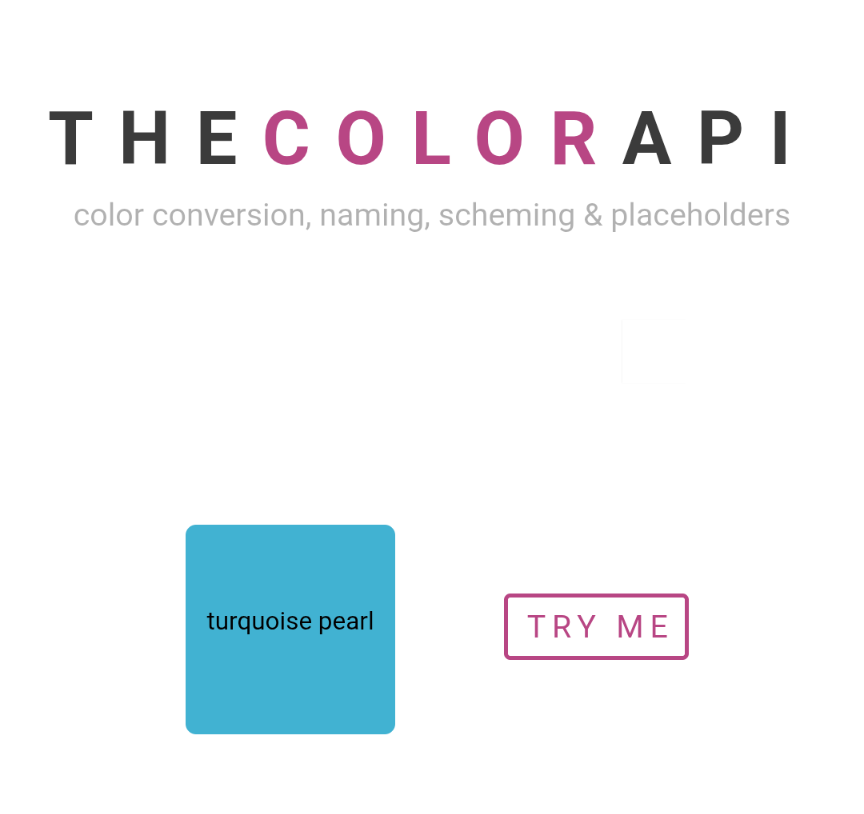

```meta-bind
INPUT[TAGS-Tiny-Tools][:tags]
```

___
API for any valid color and conversion into any other format, the name of the color, placeholder images and a multitude of schemes
___



```cardlink
url: https://www.thecolorapi.com/
title: "The Color API"
description: "The best color conversion, naming and scheming API out there."
host: www.thecolorapi.com
favicon: https://www.thecolorapi.com/images/favicon.png
```
