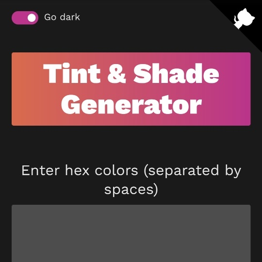

```meta-bind
INPUT[TAGS-Tiny-Tools][:tags]
```

___
Easily make tints and shades that match the output of Chrome DevTools, PostCSS, and Sass.
___



```cardlink
url: https://maketintsandshades.com/
title: "Tint and Shade Generator"
description: "Easily make tints and shades that match the output of Chrome DevTools, Sass, Less, and PostCSS."
host: maketintsandshades.com
favicon: https://maketintsandshades.com/favicon.ico
image: https://maketintsandshades.com/images/share.jpg
```
