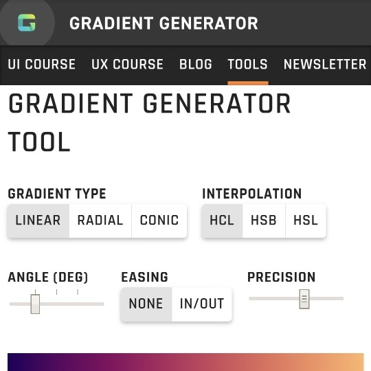

```meta-bind
INPUT[TAGS-Tiny-Tools][:tags]
```

___
Create gorgeous, buttery-smooth color gradients for UI design. Export as CSS or SVG image.
___



```cardlink
url: https://learnui.design/tools/gradient-generator.html
title: "Gradient Generator Tool"
description: "Create & export linear, radial, & conic gradients. Automatically creates vivid, colorful gradients. One-click CSS or SVG (drag-and-drop into Figma, Sketch, Canva, etc)."
host: learnui.design
favicon: https://learnui.design/favicon.png
image: https://learnui.design/tools/img/og-gradient.png
```
