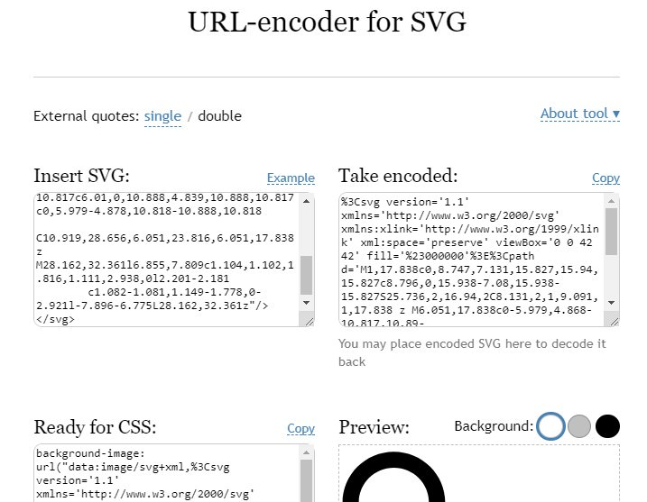

```meta-bind
INPUT[TAGS-Tiny-Tools][:tags]
```

___
Convert SVG image code into CSS for background image
___



```cardlink
url: https://yoksel.github.io/url-encoder/
title: "URL-encoder for SVG"
host: yoksel.github.io
```
