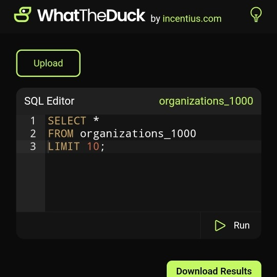

```meta-bind
INPUT[TAGS-Tiny-Tools][:tags]
```

___
Run SQL queries against your CSV files right in the browser
___



```cardlink
url: https://whattheduck.incentius.com/
title: "WhatTheDuck"
description: "It allows users to upload CSV|Parquet files, store them in tables, and perform SQL queries on the data. The application supports downloading filtered results in CSV format, uploading multiple files, and running join queries. Please note that the data is stored temporarily in memory"
host: whattheduck.incentius.com
favicon: https://whattheduck.incentius.com/favicon.png
image: https://whattheduck.incentius.com/images/WhatTheDuck.png
```
