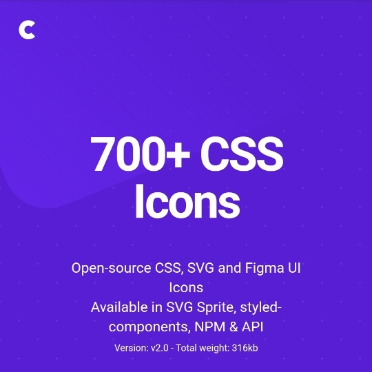

```meta-bind
INPUT[TAGS-Tiny-Tools][:tags]
```

___
Open-source CSS, SVG and Figma UI Icons
Available in SVG Sprite, styled-components, NPM & API
___



```cardlink
url: https://css.gg/
title: "css.gg"
description: "A comprehensive, open-source CSS icons library. Featuring Vanilla CSS, SVG and Figma UI icons"
host: css.gg
favicon: data:image/svg+xml,%3Csvg%20width%3D%2242%22%20height%3D%2242%22%20fill%3D%22none%22%20xmlns%3D%22http%3A%2F%2Fwww.w3.org%2F2000%2Fsvg%22%3E%3Ccircle%20cx%3D'21'%20cy%3D'21'%20r%3D'20'%20fill%3D'%235F19DD'%2F%3E%3Cpath%20d%3D'M27%2012a3%203%200%200%200-3%203v12a3%203%200%201%200%203-3H15a3%203%200%201%200%203%203V15a3%203%200%201%200-3%203h12a3%203%200%200%200%200-6Z'%20stroke%3D'%23fff'%20stroke-width%3D'2'%2F%3E%3C%2Fsvg%3E
image: https://css.gg/og?title=CSS.GG
```
