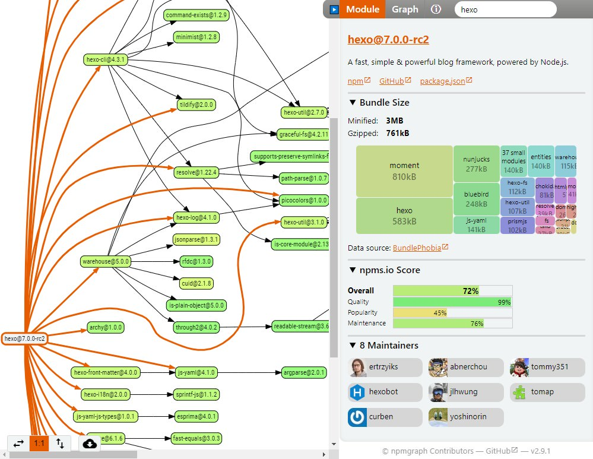

```meta-bind
INPUT[TAGS-Tiny-Tools][:tags]
```

___
Show interactive dependency graph of a npm module or analyze your complete package.json
___



```cardlink
url: https://npmgraph.js.org/
title: "npmgraph - NPM Dependency Diagrams"
description: "Graph / visualize of npm dependencies"
host: npmgraph.js.org
favicon: https://npmgraph.js.org/favicon.png
image: https://github.com/user-attachments/assets/7b1414d8-a6fd-4d00-8b49-ed490b077b01
```
