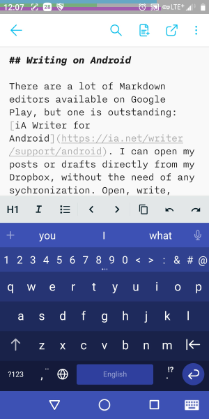

I work with several devices, some Windows, some Android, and sometimes I have time to write on my articles at home (Notebook, Tablet), in my spare time in the office (Desktop, Laptop) or on my way to somewhere (Smartphone). Right now I'm am in a barber shop, waiting for my haircut and write these lines. So, wherever I am, I need the Hexo project (see [Part One of this series](/categories/Tools/A-New-Blog-VS-Code-Hexo-and-GitHub-Pages/)) locally, but in sync on a digital device.

<!-- more -->

## Sync Hexo Project

Best option for me to achieve this was  [Dropbox](https://dropbox.com). Another benefit on that is: I can work on the structure of the blog wherever I am and commit when the new feature or improvement is done, because all Git related files are always in sync too.

## Writing and Editing on Windows

My preferred editor is [Visual Studio Code](https://code.visualstudio.com/). Good file handling, easy writing, full Git integration and tons of other plugins and helpers. Chapeau Microsoft, well done.

Some of the following VS Code plugins makes working with Hexo on GitHub pages a breeze:

---

{.lefty})    
Adds Hexo commands like ``init``, ``new``, ``generate``, ``server`` and ``clean`` to the VS Code command palette.

---

  
Keyboard shortcuts for basic formatting, automatic list editing, autocomlete for images,  table formatter and much more for an easier handling of Markdown.

---

  
Markdown linting and style checking

---

  
Adds syntax highlighting and code completion to Stylus files

---

  
Complete visual management of your repositories in VS Code

---

  
View a Git Graph of your repository with all changes and manage commits.

---

With this editor and it's helpers, I'm just two clicks away from publishing a new article or even a new version of the Hexo blog itself.

## Writing on Android

There are a lot of Markdown editors available on Google Play, but one is outstanding: [iA Writer for Android](https://ia.net/writer/support/android). I can open my posts or drafts directly from Dropbox, without the need of any sychronization. Open, write, close, done.

