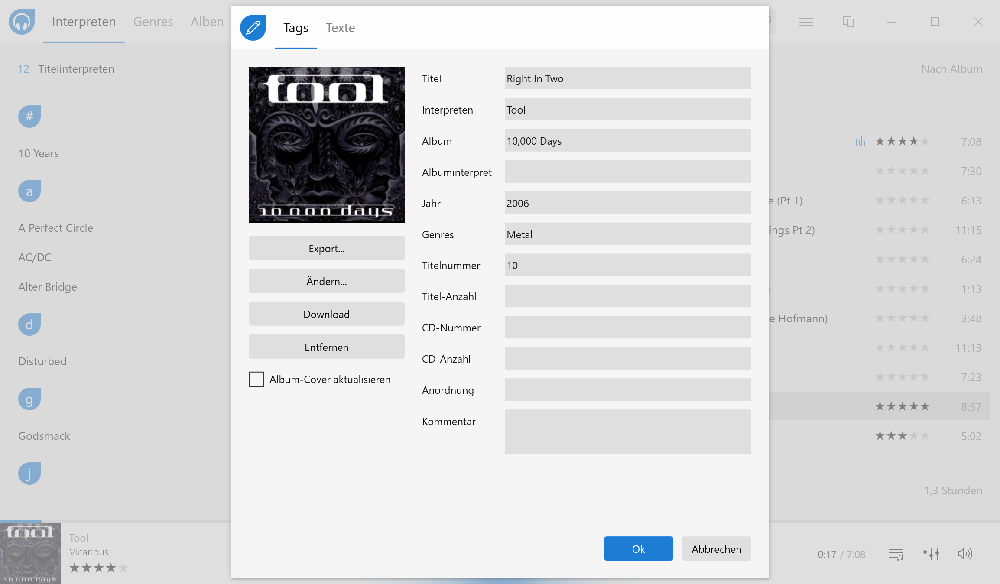
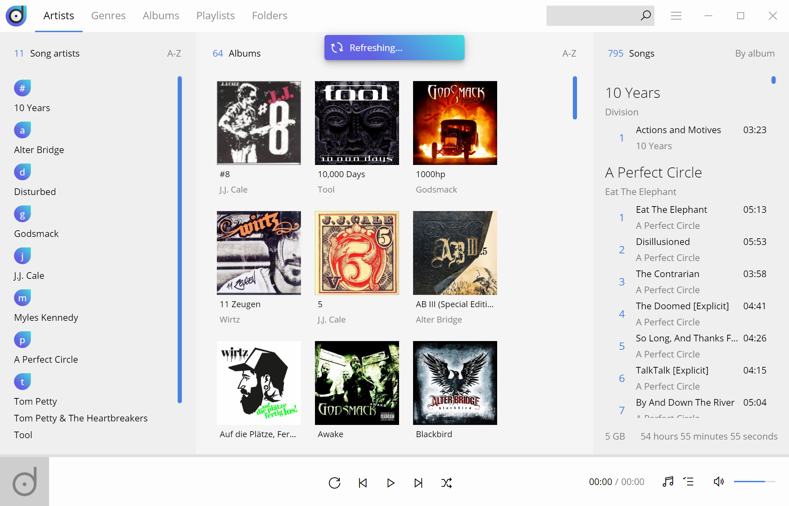

There are about fourleventy millions music apps for smartphones running Android and iOS. However, most of them are relatively junk or try to foist malware on users. You have to make sure that you separate the wheat from the chaff. On the other hand, the situation is surprisingly different for Windows, the much older operating system. The older ones of us will still remember the glorious WinAmp times, whose current owner Radionomy has been making a very long new attempt for a new version 6 since 2018 (version 5.8 is already a handsome 6 years old), but you can actually count the good music players for Windows 10 and higher on one hand, if you subtract the streaming apps such as Spotify and Co. and disregard everything that comes along as a jack of all trades and can ALSO play MP3. The best known are the in Windows included and miserably failed iTunes clone from Micosoft called **Groove**, **[AIMP](https://www.aimp.ru/)**, **[foobar2000](https://www.foobar2000.org/)**, **[MediaMonkey](https://www.mediamonkey.com/)** and **[MusicBee](https://www.getmusicbee.com/)**. Some nostalgic people might also add the good old [Windows Media Player](https://support.microsoft.com/en-us/windows/get-windows-media-player-81718e0d-cfce-25b1-aee3-94596b658287), which managed to survive on the net despite Groove. If you look at the download pages of these music player candidates and try to look behind the business model, some of them simply do not download. One or the other player also overdoes it with the featuritis. Bouncing balls or bars to the music are gimmicks that were thought to be outdated long ago, when it is actually only about listening to music.

Belgian software developer **Raphaël Godart** ([twitter.com/RaphaelGodart](https://twitter.com/RaphaelGodart)) must have felt the same way a few years ago when he set out to launch his own player for local MP3 collections, which in this case sounds falsely commercial because his player **[Dopamine](http://www.digimezzo.com/software/)** is freely available on GitHub and open source under GPL 3.0 license. It plays music under a plain and simple, yet chic interface ... Period. Everything a music lover's heart desires is on board:

<!-- more -->

- Automatic reading of a folder configured at the beginning.
- Display of the collection by artist, genre, album, title or folder
- Playlist management
- Light and dark theme, including setting the accent color
- Interface in 30 languages
- Integration with taskbar and notification bar
- Automatic updates



The design of the application is instantly convincing. Everything is limited to the most necessary, an accent color and a lot of white e.g. gray space, so that not only the ear feels comfortable with the music, but also the eye. And all this at a very good speed and nicely animated transitions from one view to another.

Besides the basic ability to play MP3 files, the author has also included a rudimentary, but well-functioning editing function of the MP3 metadata. Furthermore, any star assignments or added lyrics are stored directly in the file and not just in the SQLite database behind it.

However, Godart has also included a few useful things from the Featuritis department in its program. On the one hand, it downloads information from last.fm about the currently played artist and you can scrobble there if you like, and on the other hand, it scans some lyric collections for the lyrics, which unfortunately rarely works.

Quite unique is one of the most recently added features: a blacklist! Yes, many an album of a favorite musician contains a track that he would have been better off sparing himself. Such pieces can now be specifically hidden, so that the musical enjoyment is not spoiled.

## Further development

New releases of Dopamine 2 since version 2.0.8 are not as frequent as before, because the program is basically developed out and Raphaël only adds smaller features, translations and bugfixes. Instead, 4 years after the release of the first version two years ago, he has embarked on a completely new development with version 3. Where Dopamine up to version 2 was developed with Microsoft C# and WPF (Windows Presentation Foundation), the latest will be based on Electron, Angular and Typescript, i.e. packaged web technology (HTML, CSS and JavaScript) for all operating systems and not just Windows. Currently, Godart has reached Preview 10, which has by far not the same scope of the previous version, but is already running stable.

## Music in the cloud

If you're on the go and have stored your music on a cloud service like Microsoft's OneDrive, you might pay attention to the fact that on a device connected to it, the entire collection is not downloaded, but only selected parts in order to save local storage space. Microsoft makes it easy for users there: it displays all OneDrive files in Windows Explorer with 0 bytes of space used and only downloads them when they are accessed or when the user selects *Always keep on this device* in a folder's context menu. This works quite beautifully with Dopamine 2. It, with support from C# and the operating system, simply ignores all those files that are not available on the disk in real terms when scanning the specified music folder. Dopamine 3, on the other hand, in which the scan must take place via Node.js and the ``fs.readdir()`` method, immediately triggers the download function of OneDrive and you unintentionally fill up your disk.

## Curiosity on the side

Raphaël's C#/WPF solution weighs 76 MB when installed, 2.5 MB of it for the executable, the new Electron-based one under Windows, however, already 302 MB, with the EXE being a whopping 128 MB. If you take a look at the code base, this becomes even more obvious: while the Windows-only version comes along with 760 files, the new Electron version already contains 86,092 files in 7,948 folders with a total weight of almost one gigabyte after running ``npm install``! Once again you can see that platform independence in the brave new Node.JS world is often bought with heavy weight. This is mainly due to the necessity (or the unkindness, depending on how you look at it) to drag along thousands of dependent libraries (dependencies), which occasionally only bring a string to a certain width or something similarly trivial. Not to mention the problems with depublicated or malware-infested dependencies, which have recently upset large parts of the community.

## Conclusion

Dopamine 2 is a really fantastic music player for Windows that simply outshines most others due to its simplicity and well-done interface. Let's see if Godard manages to do something similar with version 3 and Electron. It's a challenge, but he seems to be a full-blooded developer. Chapeau Raphaël...
