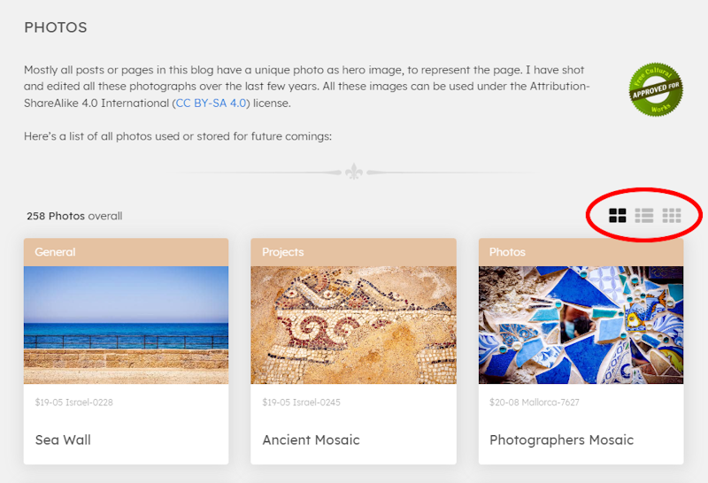

The [**photo section**](/photos) on my blog, the main page of which I have now named COLLECTION, initially only served as an overview of the available or already used hero images for the various pages of the blog, such as posts and others. In the meantime, detailed pages for the individual photos and a world map have been added, in order to follow the IndieWeb idea that I want to publish my photos on my own site with all the information first and then syndicate them on other platforms.

At some point I implemented three different view modes for the photos, more out of a desire to play around than out of necessity: **Grid**, **List** and lastly **Masonry**. Depending on the device class, one mode or the other has its advantages in terms of overview.



What was still missing, however, was the option to filter and/or sort the amount of photos according to their use, as over time there are more rather than fewer and it becomes increasingly difficult to find the image you are looking for. I had already placed 3 icon buttons at the top right-hand corner for the various view modes and was faced with the decision of how to implement further control elements such as drop-down lists or similar. But I didn't want the interface to look like "Your Company's App" at some point, plastered with controls that distract the eye from the photos. Ideas such as folding and unfolding control panels, i.e. hiding the functionality, were also out of the question at second glance. That would only have shifted the problem.

<!-- more -->

---

## Why not a sentence in natural language?

After thinking about it for a while, I realised that I had converted the display of the number of photos as a numeral with text at the top left-hand corner, for instance "289 photos". **Why not take this idea one step further and make a complete sentence out of it** ... like

> 289 photos overall displayed as list sorted by date created descending

or, now with the important information marked ...

> <u>127</u>&nbsp;&nbsp;photos&nbsp;&nbsp;<u>unused</u>&nbsp;&nbsp;displayed as&nbsp;&nbsp;<u>grid</u>&nbsp;&nbsp;sorted by&nbsp;&nbsp;<u style="white-space: nowrap;">date created</u>&nbsp;&nbsp;<u>ascending</u>

or ...

> <u>139</u>&nbsp;&nbsp;photos&nbsp;&nbsp;<u>used</u>&nbsp;&nbsp;<u style="white-space: nowrap;">for posts</u>&nbsp;&nbsp;displayed as&nbsp;&nbsp;<u>masonry</u>&nbsp;&nbsp;sorted by <u style="white-space: nowrap;">file name</u>&nbsp;&nbsp;<u>ascending</u>

Although this sentence is not grammatically correct, it contains all the information that describes the list and that could be adapted dynamically. If you break it down into its components, you get placeholders that can be filled variably:

```txt
[COUNT] photos [FILTER-STATUS] [FILTER-TYPE] displayed as [PRESENTATION] and sorted by [SORT-FIELD] [SORT-ORDER]
```

These placeholders could now not only be used to place a variable value, but some could also be used as direct trigger points for changing the view.

Here a list of all the necessary placeholders with the values they should be able to assume:

- **COUNT** - display only
  Number of filtered photos

- **FILTER-STATUS** - trigger
  Possible values ``overall``, ``unused`` and ``used``

- **FILTER-TYPE** - trigger
  *(only necessary when FILTER-STATUS is set to ``used``)*
  Possible values: ``for posts``, ``for drafts``, ``for notes``, ``for default pages``, ``for dynamic pages``, ``for anything pages`` or ``at start page``

- **PRESENTATION** - trigger
  Possible values: ``list``, ``grid`` or ``masonry``

- **SORT-FIELD**  - trigger
  Possible values: ``file name``, ``title`` or ``date created``

- **SORT-ORDER**  - trigger
  Possible values: ``ascending`` or ``descending``

To make clear that some of the placeholder elements in this sentence are not just for display, but also have a function, I have given them the ``MARK`` tag, which has the nice side effect that the browser takes care of the colour highlighting without any intervention.

These thoughts result in the following HTML framework for the sentence, within a wrapper named ``view-bar``:

```html
<div class="view-bar">
  <span id="view-count">[COUNT]</span> 
  <span>photos</span>
  <span id="view-filter-status">
    <mark>[FILTER-STATUS]</mark>  
  </span>
  <span id="view-filter-type">
    <mark>[FILTER-TYPE]</mark>
  </span>
  <span>displayed as</span>
  <span id="view-presentation">
    <mark>[PRESENTATION]</mark>
  </span>
  <span>sorted by</span>
  <span id="view-sort-field">
    <mark>[SORT-FIELD]</mark>
  </span>
  <span id="view-sort-order">
    <mark>[SORT-ORDER]</mark>
  </span>
</div>
```

**Example:**
<p>
<div class="view-bar">
  <span id="view-count">[COUNT]</span>
  <span>photos</span>
  <span id="view-filter-status">
    <mark>[FILTER-STATUS]</mark>  
  </span>
  <span id="view-filter-type">
    <mark>[FILTER-TYPE]</mark>
  </span>
  <span>displayed as</span>
  <span id="view-presentation">
    <mark>[PRESENTATION]</mark>
  </span>
  <span>sorted by</span>
  <span id="view-sort-field">
    <mark>[SORT-FIELD]</mark>
  </span>
  <span id="view-sort-order">
    <mark>[SORT-ORDER]</mark>
  </span>
</div>
</p>

---

## How to implement the triggers?

The standard control element for selecting from two values in HTML is the checkbox ... ON and OFF, and a matching text label. If there are more, radio buttons or drop-down lists are usually used in forms. But it should not look like a form, so it was out of the question to display one of the above-mentioned control elements in the sentence when clicking or tapping on one of the trigger points. 

It felt most natural to me if the user simply clicked or tapped on the selected placeholder and the next possible value would be selected, displayed and the view of the photos immediately changed accordingly. In other words, a **multi-toggle element**.

It was clear to me that the user would have to interact with elements with more than two options several times to achieve the desired result, but on the one hand this made up for the simplicity of the interaction and on the other hand the selected value should be saved in the browser so that, for example, the favoured presentation could be directly preset when the page is loaded. 

Furthermore, simple toggles in HTML and CSS could also be implemented without JavaScript, but this would not work for multi-Toogle elements with a defined sequence, but I needed JS to save the current value anyway.

The HTML code from above, extended by the necessary code (for the sake of simplicity only) for the PRESENTATION element, in which the user should be able to toggle through three options: ``list``, ``grid`` and ``masonry``:

```html
<div class="view-bar">
  ...
  <span>displayed as</span>
  <span id="view-presentation">
    
    <input type="radio" checked
           name="view-presentation" 
           id="presentation-grid" 
           data-presentation="grid"
           data-next-presentation="list">
      <label for="presentation-grid" 
             title="Display as list">
        <mark>grid</mark>
      </label>
      <input type="radio" 
             name="view-presentation" 
             id="presentation-list"
             data-presentation="list"
             data-next-presentation="masonry">
      <label for="presentation-list" 
             title="Display as masonry">
        <mark>list</mark>
      </label>
      <input type="radio" 
             name="view-presentation" 
             id="presentation-masonry"
             data-presentation="masonry"
             data-next-presentation="grid">
      <label for="presentation-masonry" 
             title="Display as grid">
        <mark>masonry</mark>
      </label>
  </span>
  ...
</div>
```

The set value is held by a radio element, which is hidden from the user via the following functional CSS. Just like the label element bound to the respective radio. A toggle group is formed using the same value for the ``name`` attribute for all radio elements. The ``data`` attributes define the next value to be set later via JavaScript by click or tap.

```css
.view-bar input[type=radio] {
  display: none;
}
.view-bar input[name="view-presentation"] + label {
  cursor: pointer;
  display: none;  
}
.view-bar input[name="view-presentation"]:checked + label {
  display: inline-block;
}
```

In the HTML, the first radio element is equipped with the ``checked`` attribute, but this is only the default value for the initial loading, as the selection is subsequently saved in a cookie and then read and set in the subsequent script when the page is loaded. At this point, the click event is also bound to the radios, which reads and triggers the NEXT data attribute for the following settings and sets the above-mentioned cookie.

```js
<script>
  ...

  // preset last value from cookie
  let currentPresentation = getCookie("photos-presentation");
  if (!currentPresentation) {
    currentPresentation = 
      document.querySelector("input[name=view-presentation]:checked").getAttribute("data-presentation");
  }

  // Bind click event to presentation radios
  document.querySelectorAll("input[name=view-presentation]").forEach(element => {
    element.addEventListener("click", (event) => {
      setPresentation(element);
    });
  });

  // method for switching presentation mode
  function setPresentation(ePresentation) {
    let newPresentation = ePresentation.getAttribute("data-next-presentation");
    let eNewPresentation = document.querySelector("#presentation-" + newPresentation);
    eNewPresentation.checked = true;

    currentPresentation = newPresentation;
    setView();
  }

  // method for refreshing view
  function setView() {
    
    //... code for changing view with new presentation mode

    document.querySelector("#presentation-" + currentPresentation).checked = true;
    setCookie("photos-presentation", currentPresentation, 365);
  }

  // initial call to set view
  setView();

  ...

  // helper
  function getCookie(name) {
    var v = document.cookie.match('(^|;) ?' + name + '=([^;]*)(;|$)');
    return v ? v[2] : null;
  }
</script>
```

The ``setView`` method is a global function that is called each time one of the triggers involved changes, like in the example for the presentation mode. It is controlled by variables that contain the respective values to be set.

The following codepen interactively shows how this first example with the same code works. I have not included the implementation of the photo list here, as it does not play an important role here.



The other placeholders SORT-FIELD and SORT-ORDER are working in a similar way, so I don't need to mention them here. FILTER-STATUS and FILTER-TYPE, on the other hand, are interdependent, because FILTER-TYPE is only used if FILTER-STATUS is set to ``USED``. Another difference is that only these placeholders manipulate the length of the list and therefore the COUNT.

