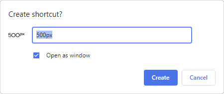
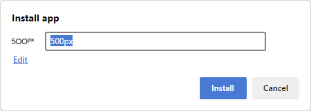

Mostly all modern browsers nowadays offer a way to put web pages on the desktop as an "app" link. Be it as a real PWA to install or simply via the "Add To Homescreen" (A2HS) feature. On execution those links opens up the page in a seperate window so that it feels like an app to the user.

With the simple A2HS, however, there is a problem in this regard, because if the developer of the website does not offer any PWA features, such as the definition of a start URL over a manifest file, and implements url redirects before calling the actual page, for example for authentication, the user probably saves the wrong url via A2HS.

This wouldn't be a problem, if Chromium-based browsers would offer the possibility to customize not only the name, but also the URL to be called when creating the link. Unfortunately, this is not the case.





<!-- more -->

The other day I had exactly this problem. The entry URL to a web portal was like ``https://auth.some-domain.com``, where I had to provide my credentials (Windows Authentication) and then I was redirected to something like ``https://portal.some-domain.com``. Of course, the developers included a session timeout, which caused actions to result in error messages after the time expired, but I wasn't returned to the authentication page, instead I was left with the error message on the portal page. Closing the window and opening it again didn't help, because the URL of the web app I had created was pointing to the portal and not the authentication URL.

If a UI doesn't provide a functionality, like customizing the URL of a Chromium Web App when it's created, curious developers look on the disk, because it will be stored somewhere...

## The Chromium Web App Skeleton

Starting point of the investigation is the link on the Windows desktop itself.

```txt
"C:\Program Files (x86)\Google\Chrome\Application\chrome_proxy.exe"  --profile-directory=Default --app-id=lmfpdgnbfjnnpcjlfgejladkdlhgckbo
```

The executable, in this case Chrome on Windows, is not the browser itself but a proxy, a specialty exclusively for Windows, in order to display a particular icon for the Web App (see the [commented code](https://chromium.googlesource.com/chromium/src/+/HEAD/chrome/chrome_proxy/chrome_proxy_main_win.cc) for more information).  
The first parameter ``profile-directory`` points to the profile the Chrome user uses and the second parameter is a unique ``app-id`` to identify the web app internally.