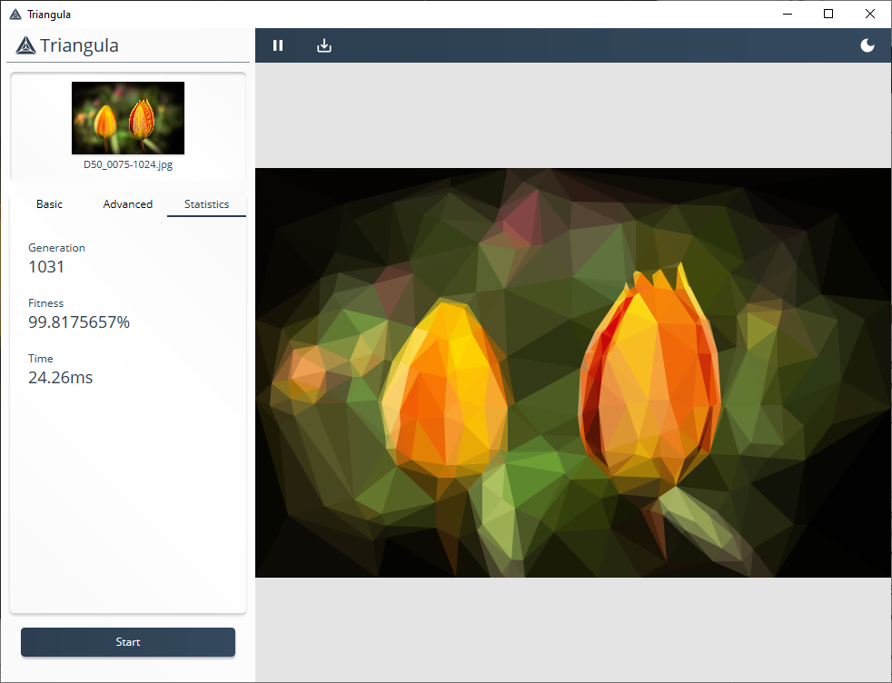
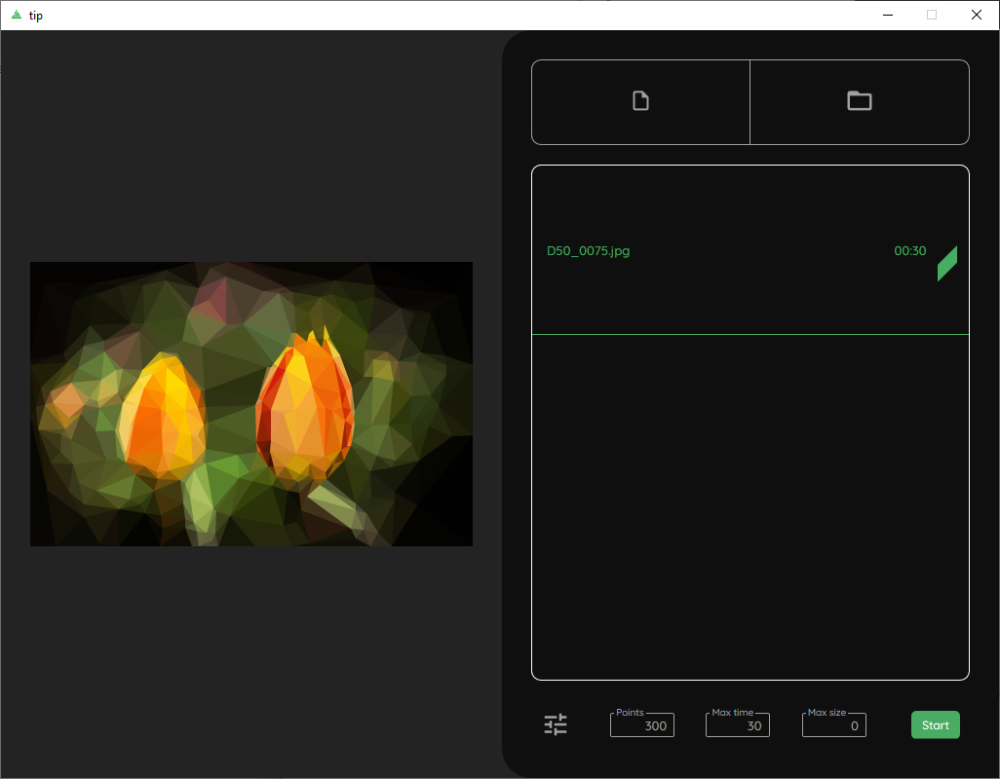

**Triangula ist ein gelungenes Tool, um Bilder kunstvoll in Polygone zu zerlegen. Ein weiteres Tool sorgt zudem dafür, sie als Website-Platzhalter einsetzen zu können.**

Wenn von Triangulation die Rede ist, verstehen Nicht-Mathematiker im Allgemeinen darunter eine geometrische Methode zur Abstandsmessung. Grob gesagt kann man über zwei bekannte Punkte im Raum einen dritten über die Winkel zu ihm berechnen. Im ein oder anderen Hollywood-Streifen der Genres Krieg- oder Spionagefilm ist einem das sicherlich schon mal untergekommen.

Triangulation bezeichnet aber auch das Zerlegen einer Fläche in Dreiecke oder, ganz generell, die Beschreibung eines Objektes mittels Polygonen. Verwendung findet das in der Topologie und der Landvermessung, aber auch in bildgebenden Verfahren der Modellierung.

Wie wunderbar man dieses Feld der Mathematik auf Fotos anwenden kann, zeigt der GitHub-Benutzer [**RyanH**](https://github.com/RH12503) mit seinem in Go geschriebenen Programm [**Triangula**](https://github.com/RH12503/triangula),  das ein gegebenes JPG- oder PNG-Bild zunächst grob in Dreiecke zerlegt und dann über Mutationen immer weiter verfeinert. Dabei kann man unter anderem festlegen mit wievielen Punkten man starten möchte und wieviele Mutationen das Programm durchführen soll. Auch ist es möglich das neue Bild über Sechsecke (Hexagone) zu berechnen statt über klassische Dreiecke.

*Oberfläche des in Go geschriebenen Tools Triangula*

Das Ergebnis sind stilisierte Abbildungen des Originals, die man zum Beispiel als schickes Desktop-Hintergrund verwenden kann. Durch die Abstraktion des eigentlichen Motivs sind solche Bilder auch sehr gut geeignet als Header-Images auf Webseiten, wie zum Beispiel Blogs, wenn das Bild nicht vom eigentlichen Inhalt ablenken soll. Ein solches Bild hat eine große Nähe zum Original, wirkt aber eher wie Kunst.

Als Ausgabeformat steht neben PNG auch SVG (Scalable Vector Graphics) zur Verfügung, was Sinn ergibt, denn SVG ist ein XML-Format und die vom Programm berechneten Polygone kann man auch direkt als entsprechende ``polygon``-Einträge als Text wegschreiben. Die erzeugten SVG-Dateien sind dabei je nach Original um den Faktor 30 kleiner und passen so an vielen Stellen viel besser zu knappen Bandbreiten oder aufgebrauchten Verbrauchslimits im Internet.

## Einsatz von Triangula auf der Kommandozeile

Ryan bietet sein Programm Triangula auch als [CLI-Version](https://github.com/RH12503/Triangula-CLI/) an, das über die Kommandozeile aufgerufen wird. Dabei ist der Prozess des Triangulierens in zwei Teile getrennt: Erst erzeugt man über den Parameter ``run`` die gewünschte Abstraktion eines Originalbildes, die in einer JSON-Datei auf der Festplatte abgelegt wird und in einem zweiten Schritt erstellt man mittels ``render`` und der Angabe der JSON-Datei entweder ein PNG oder ein SVG als Ausgabedatei.

Da das Kommandozeilenwerkzeug die gleichen Optionen wie die UI-Version bietet, eignet es sich hervorragend, um zum Beispiel beim Build einer Webseite die verwendeten Bilder automatisiert zu verarbeiten. Auch ist es damit wesentlich einfacher einen ganzen Ordner mit Bildern in solch künstlerlische Abstraktionen zu verwandeln.

## Verwendung von triangulierten Bildern als Platzhalter auf Webseiten

Je nachdem wie gut die Internetverbindung ist und der Verstand des Entwicklers einer Website gearbeitet hat, kann es schon mal etwas dauern bis der Browser des Smartphones das x-Megabyte große Header- oder Illustrationsbild geladen hat, um es endlich anzeigen zu können. Richtig nervig wird es, wenn auf der Website für das Bild zuvor kein Platz reserviert wurde und der Text, den man begonnen hat zu lesen, auf einmal weghüpft.

Die Lösung ist in jedem Fall immer möglichst kleine und an das Gerät angepasste Bilder zu verwenden, aber diese haben immer noch eine gewisse Dateigröße, wenn sie gut aussehen sollen. Um das Textspringen zu verhindern verwendet man heutzutage meist graue Platzhalter mit oder ohne Ladebalken, um dem Benutzer zu signalisieren, dass an dieser Stelle in Kürze etwas angezeigt wird.

Ryan hat auch hierfür eine erstaunlich effektive Lösung gefunden: [tip - Triagulated Placeholders](https://github.com/RH12503/tip) - Erstellen von kleinstmöglichen triangulierten Bildern und Überblenden mittels JavaScript.

Basis ist ein ebenfalls in Go geschriebenes Frontend, das die gleichen Algorithmen wie Triangula verwendet und mit dem der Benutzer über die Oberfläche mehrere Originalbilder oder gleich einen ganzen Ordner mit Fotos auf einmal verarbeiten kann.

*Sehr simple, aber funktionale Oberfläche des ebenfalls in Go geschriebenen Tools tip zur Erzeugung von binären Platzhaltern für Webseiten*

Ausgabeformat bei **tip** ist aber kein PNG oder SVG, sondern eine binäre Datei, die von allen technischen Möglichkeiten am wenigsten Speicherplatz verbraucht.

Zum Vergleich die erzeugten Dateigrößen des Beispielbildes mit der Auflösung 1024 x 660:

|Bild|Größe|
|---|---|
|Original|386 KB|
|Triangula PNG|223 KB|
|Triangula SVG|40,3 KB|
|tip TRI|3,03 KB|

Diese Dateien, mit der Endung TRI, werden vom Web-Entwickler im IMG-Tag eines Bildes einer Seite im Attribut ``data-src`` referenziert und ein nur 200 Zeilen langes **JavaScript**, das ebenfalls eingebunden und mit der Webseite ausgeliefert wird, kümmert sich um die sofortige Anzeige dieser TRI-Datei beim Laden der Seite und das sanfte Überblenden auf das Originalbild, sobald es geladen wurde. Schöner kann man es kaum machen.
