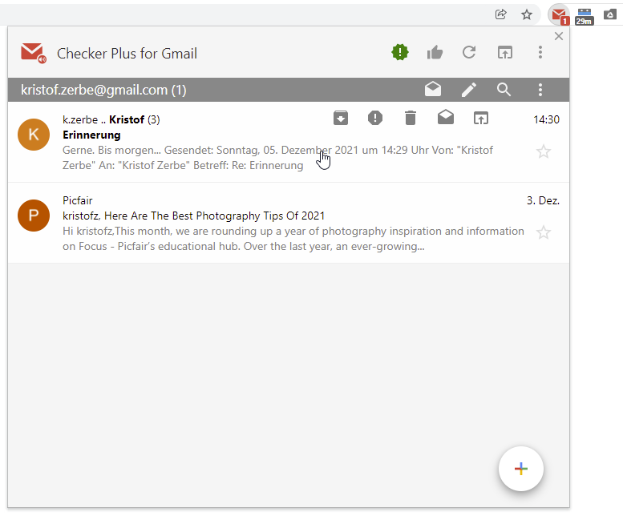
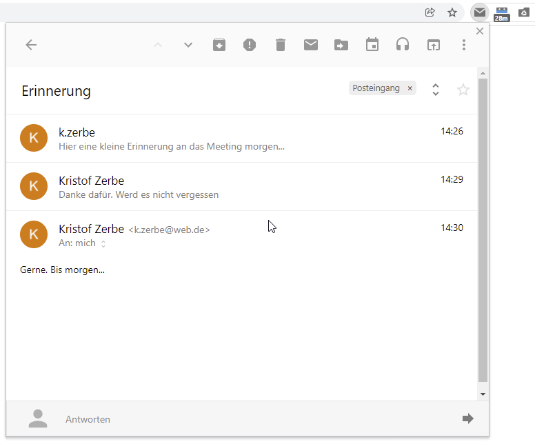
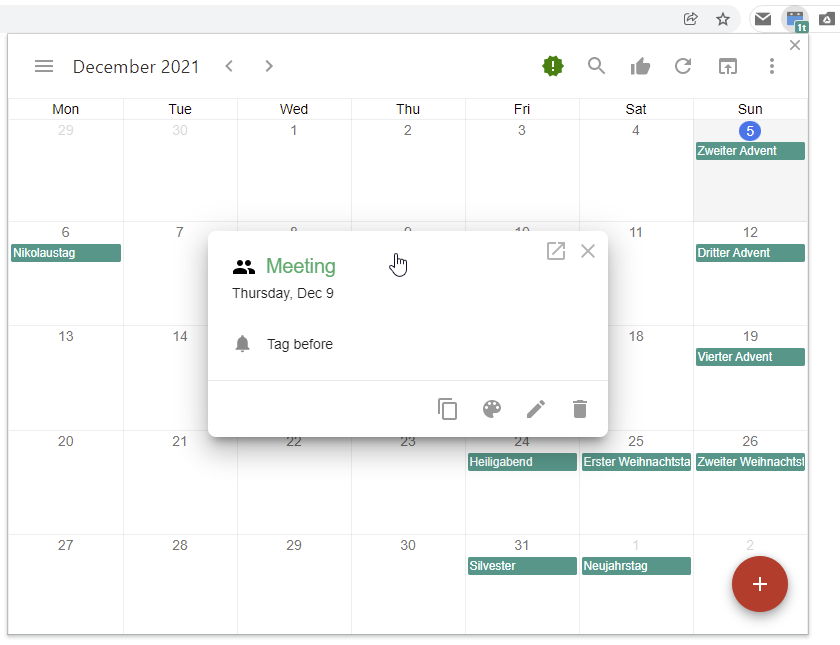

**Drei Chrome-Browser-Erweiterung aus Kanada für den schnellen Zugang zu den Google-Diensten Gmail, Calendar und Drive**

Wer ein Google-Konto sein Eigen nennt, nutzt meist auch den Web-basierten Mailer **Gmail**, oft zudem auch **Google Calendar** für die Termine und vielleicht auch **Google Drive** für die Speicherung von Dateien in der Cloud. Der amerikanische Internet-Konzern macht es den Benutzern hinsichtlich der Bedienung sehr einfach seine Web-basierten Dienste zu nutzen. Die Einstiegshürden sind niedrig und die Oberflächen aufgeräumt und intuitiv. 

Setzt man den hauseigenen Chrome-Browser ein, kann man sich zudem über eingehende Mails oder anstehende Termine informieren lassen. Ein Klick und der Browser öffnet mit Gmail oder Google Calendar...

Aber nicht immer ist es notwendig oder wünschenswert eines der Google Tools in einem neuen Browser-Fenster komplett zu laden, wenn man vielleicht schon zwei, drei Dutzend Tabs in mehreren Fenstern geöffnet hat und die Gefahr droht den Überblick zu verlieren. 

Etwas Ähnliches scheint sich der in Montreal lebende Software-Entwickler **[Jason Savard](https://jasonsavard.com/)** vor 10 Jahren auch gedacht zu haben, als er begann eine Chrome-Erweiterung zu schreiben, die dem Benutzer mittels eines kleinen Icons in der Erweiterungsleiste des Browsers eine neu eingegangene Gmail melden und per Klick darauf ein einem eigenen Popup-Fenster direkt anzeigen sollte. Entstanden ist **[Checker Plus for Gmail](https://jasonsavard.com/Checker-Plus-for-Gmail)**.

Neben der Erweiterung für Gmail, bietet Savard weitere für Calendar und Drive an, wobei alle eines gemeinsam haben: man kann die wichtigsten Funktionen der Dienste direkt in dem sich öffnenden Popup erledigen. Mail beantworten, neue Mail schreiben, Termin mit Erinnerung anlegen, Datei hochladen, Datei-Link zum Teilen abrufen ... alles funktioniert ohne die Oberflächen der Dienste laden zu müssen und in einem beliebigen Chrome-Fenster.

Für den Autor und wahrscheinlich einige der fast 2 Millionen Benutzer sind die Checker Plus Erweiterungen von der Sorte Tools, von denen man sich gar nicht mehr vorstellen kann ohne sie zu arbeiten, so schnell gewöhnt man sich in die Funktionalität und passt den eigenen Workflow daran an.

## Checker Plus for Gmail

Das Checker-Plus-Tool für den Web-Mailer Gmail verankert ein Icon in der Erweiterungsleiste, dass die Anzahl der ungelesenen Mails mittels eines Indikators anzeigt. Da es möglich ist in der Erweiterung mehrere Gmail-Konten zu konfigurieren, werden in der Zahl alle ungelesenen zusammengefasst.

Klickt man auf das Icon, öffnet sich ein Popup mit einer übersichtlichen Liste aller Konten und deren ungelesenen Mails. Die Mails werden dabei im Kompaktmodus angezeigt, d.h. man sieht neben dem Absender und dem Betreff auch einen Auszug aus dem Mail-Text. Klickt man nun widerum auf eine Mail, wird diese vollständig im Popout angezeigt und berücksichtigt dabei auch einen eventuellen Mail-Thread vollständig. Die Icon-Schaltflächen *Archivieren*, *Spam markieren*, *Löschen*, *gelesen markieren* und *Markieren*, die beim Hovern über eine Mail angezeigt werden, bilden die meistbenötigten Aktionen ab und machen es meist überflüssig die Schaltfäche *In Gmail öffnen* zu verwenden.

### Massig Einstellungsmöglichkeiten

Mit den Jahren und jeder neuen Version (aktuell ist v22.9) sind unzählige Optionen hinzugekommen, sodaß sie von Savard inzwischen in 8 Gruppen inklusive Startseite unterteilt werden mussten:

1. Startseite mit Schnelleinstieg
2. Allgemein
3. Benachrichtigungen
4. Bitte nicht stören
5. Schaltfläche
6. Konten/Label
7. Skins und Themes
8. Tasten
9. Spracheingabe

Auf alle Einstellungen in diesem Artikel einzugehen zu wollen, wäre töricht, aber ein paar verdienen eine extra Portion Aufmerksamkeit, wie zum Beispiel unter **Konten/Label**. Hier kann sich der Benutzer entscheiden, ob die Erweiterung die zur Verfügung stehenden Gmail-Konten selbst anhand der im Browser gespeicherten Anmeldung an Gmail ermitteln soll oder er sie manuell angibt. In beiden Fällen ist es danach möglich nur bestimmte Labels für die Benachrichtigungen auszuwählen oder es beim den Standard "Posteingang" zu belassen. Sehr praktisch, wenn man sich ein System der automatischen Verteilung in "Unterordner" (Labels) eingerichtet hat.

Da die Erweiterungen auch die interaktiven Desktop-Benachrichtigungen steuert, ist es nützlich unter **Bitte nicht stören** Zeiträume definieren zu können, wo das zu unterbleiben hat. Neben der Option dafür Termine aus dem Google Calendar heranzuziehen, kann man auch wöchentlich gültige Zeitpläne dafür definieren.

## Checker Plus for Google Calendar

Das Erweiterungs-Icon der Chrome-Erweiterung für Google Calendar warnt visuell vor anstehenden Terminen und zeigt im Tooltip jene der nächsten 2 Tage an. Sitzt man den ganzen Tag am Rechner und arbeitet im Chrome Browser, kann man sich somit kaum noch rausreden, wenn man einen Termin verpasst hat, zumal die Erweiterung auch Warnungen über das Windows-Hinweissystem übernimmt.

Die Oberfläche des Popups ähnelt dem Original unter [calendar.google.com](https://calendar.google.com/) und legt lediglich die Seitenleiste unter ein Hamburger-Menü, um Platz zu sparen. Es bildet die Grundfunktionalität des Originals ab und es besteht bei seiner Verwendung kaum noch ein Anlass die Original-Website von Google zu besuchen. Es macht aber auch ein paar Dinge besser als Google. So bietet das Popup die gleichen Ansichtsoptionen wie *Tag*, *Monat*, *Woche*, *Jahr* und *Terminübersicht*, bezeichnet Letztere aber als *Liste* und fügt eine Übersicht hinzu, wie man sie von der Kalender-Android-App kennt. Zudem kann man sich seine eigene Ansicht in den Einstellungen definieren, wenn man zum Beispiel die nächsten 3 Tage oder 6 Wochen im Blick halten möchte.

Auch **Checker Plus for Google Calendar** hat in der aktuellen Version v26.1.1  eine Menge Einstellungsmöglichkeiten, wie Anzeige der Wochennummern, Markierung der Wochenenden und dergleichen. Hervorzuheben sind hier besonders die Einstellungen zu den Benachrichtigungen, die man über mehrere Konten und Kalender sehr gut feinjustieren kann.

## Checker Plus for Google Drive

Das Popup der Drive-Erweiterung ist im Grunde genommen eine Kopie der Google-Oberfläche unter [drive.google.com](https://drive.google.com). Es beschränkt sich zwar auf die Listenform und verzichtet auf Vorschauanzeigen der Dateien, aber eben auch auf Werbung wie "Speicherplatz kaufen" und dergleichen. Auch hat es im Kontextmenü eines Ordners oder einer Datei lange nicht so viele Optionen wir das Original, aber das ist im Allgemeinen zu verschmerzen, weil die wichtigsten Optionen wie *Download*, *Link kopieren*, *Umbenennen* und *Entfernen* vorhanden sind.

## Fazit

Wenige Chrome-Erweiterungen sind derart nah an den Bedürfnissen der Benutzer ausgerichtet wie die **[Checker Plus Erweiterungen](https://jasonsavard.com/)** und bieten dadurch einen solchen Nutzen. Der Funktionsumfang gerade der Gmail-Erweiterung ist schlicht beeindruckend und lässt kaum Wünsche offen. Einzig bei der Lokalisierung des Quellcodes, in die von ihm angebotenen über 30 Sprachen, könnte Savard etwas mehr Sorgfalt walten lassen. Da mischt sich dann schon mal etwas Englisch in ansonsten deutsche Oberflächen, insbesondere bei den Einstellungen. Aber jeder Entwickler der schon mal versucht hat sein Tool in derart vielen Sprachen anzubieten, wird es ihm nachsehen, denn er weiß um die viele Arbeit.

Leider ist der Einstellungsbereich **Skins und Themes** alles, nur nicht allgemein verständlich und kein Vergleich zur sonst guten UX der Erweiterungen. Wenn man sich das Popup mit Hintergrundbildern und anderen Farben hübsch machen möchte, muss man sich einlesen und Jasons Konzept der Individualiserung voneinander getrennter Elemente verstehen.

Da Jason Savard inzwischen in Vollzeit an seinen Erweiterungen arbeitet, ist er auf daraus zu generierende Einnahmen angewiesen. Einige Einstellungen an den er eigenen Aussagen zur Folge lange gearbeitet hat, hat er als "zusätzliche Funktionen" deklariert, die man erhält, wenn man einmalig oder monatlich wiederkehrend einen selbst festzulegenden Betrag an ihn spendet. Ein faires Konzept, zumal er tägliche Updates und bei Problemen gar eine Antwortzeit von 5 Minuten zusichert. Naja ;) Aber es ist schön einen Entwickler zu sehen, der mit derart viel Herzblut bei der Sache ist.
