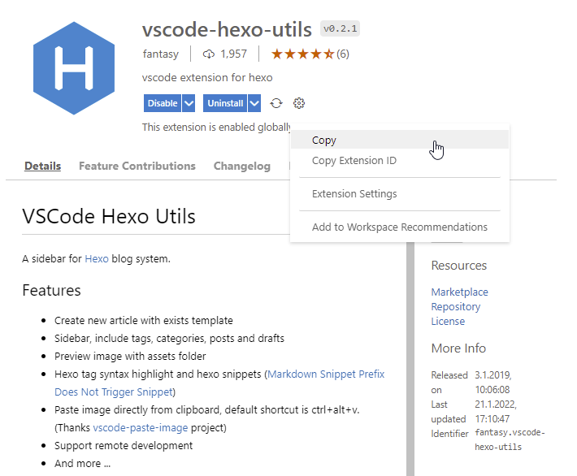

**TEASER**

...

## Der Name und die Technik dahinter

Der Name **gitpod** verrät schon einiges über die Technik hinter dem Dienst. 'git' steht für das System der Dateiverwaltung hinter dem Editor und 'pod' für die Server-Technik unter dem Editor.

### git...

Quellcode liegt heutzutage (hoffentlich) nicht mehr nur lokal auf einer Festplatte, sondern zentral und verwaltet durch eine Quellcode-Management-Software. Der momentane Goldstandard in diesem Bereich ist das von Linus Torvalds 2005 initiierte freie [Git](https://de.wikipedia.org/wiki/Git), einer verteilten Versionsverwaltung, die die Basis von populären Entwickler-Plattformen wir GitHub, GitLab oder Bitbucket darstellt.

### ...pod

Dazu kurz einen Schritt zurück in der Zeit: Es ist noch gar nicht so lange her, da nannten IT'ler eine Umgebung auf der sie eine Server-Anwendung veröffentlichten *Maschinen*, weil es dafür zunächst Hardware (ugs. "Blech") mit Prozessor, Hauptspeicher, Festplatten und dergleichen brauchte, auf der dann ein Betriebssystem der Wahl und darauf widerum die besagte Anwendung installiert wurde.

Wurde die Server-Anwendung jedoch nur sporadisch genutzt, war die teure Hardware nicht ausgelastet, sprich Ressourcen wurden verschwendet. Um dieses Problem zu beheben, wurde in den 70ern begonnen an der Virtualisierung von Hardware zu arbeiten, damit sich mehrere logisch voneinander getrennte Systeme die Hardware teilen können, um deren Auslastung zu erhöhen. In jeder der so entstehenden [virtuellen Maschinen (VM's)](https://de.wikipedia.org/wiki/Virtuelle_Maschine) kann ein beliebiges Betriebssystem und darin die benötigten Server-Anwendungen installiert und betrieben werden.

In diesem Konzept gibt es aber Redunanzen in Form des Betriebssystems. Will man zum Beispiel auf einem Blech 5 Linux-basierte Web-Server laufen lassen, muss dazu aber auch 5 womöglich identische Ubuntu-Installationen mitschleifen, die gewartet werden wollen.

[Docker](https://de.wikipedia.org/wiki/Docker_(Software)) ist nicht die einzige, aber bekannteste Software, die dieses Problem 2013 angegangen ist, indem es eine weitere Schicht, in diesem Fall das Betriebssystem, abstrahiert. Hier spricht man nun nicht mehr von einer Maschine oder VM, sondern von einem Container, in dem die Server-Anwendung läuft. Für die Orchestrierung dieser Container gibt es seit 2015 die von Google initiierte Software [Kubernetes](https://de.wikipedia.org/wiki/Kubernetes), in der die kleinste einsetzbare Einheit als **Pod** bezeichnet wird, in dem ein oder mehrere Container enthalten sind, die sich die zugeteilten Resourcen teilen.

## Konfiguration des Arbeitsbereichs eines Projektes

Neben den generellen Einstellmöglichkeiten, bietet Gitpod eine individuelle Konfiguration je Projekt. Dazu wird im Stamm des Projektordners die Datei **.gitpod.yml** gesucht und verwendet. Alle Einstellungsmöglichkeiten sind in den [gitpod Docs](https://www.gitpod.io/docs/references/gitpod-yml) gut dokumentiert.

### Verwendung eines benutzerdefinierten Containers

Der Standard-Container, den Gitpod beim Start eines Arbeitsbereiches hochfährt basiert auf Debian/Ubuntu und enthält bereits eine Menge an Frameworks und Sprachen wie Node, Java, Go, Python und einiges mehr. Wer jedoch ein anderes Image verwenden möchte, kann dies über den Eintrag **image** einstellen, entweder indem man ein öffentliches Images referenziert oder den Namen eines Dockerfiles im Projekt angibt. Die Möglichkeiten hierbei sind zahlreich und im Abschnitt [Custom Docker Image](https://www.gitpod.io/docs/config-docker) zu finden.

### Aufgaben beim Start

Um ein Projekt in Visual Studio Code zum Laufen zu bringen, braucht es gerade im  Node-Umfeld noch ein paar Dinge die eingerichtet werden müssen, wie zum Beispiel die Installation der richtigen Node.js-Version und die der abhängigen Pakete mittels NPM oder einem anderen Paketmanager. Das gleiche gilt natürlich auch für Gitpod, obgleich diese Maßnahmen nach dem Start der Arbeitsumgebung immer wieder durchgeführt werden müssen, wenn zum Beispiel der Pod nach einer Weile verworfen wurde. Für diese wiederkehrenden Aufgaben bietet die Software in der **.gitpod.yml** den [Abschnitt Tasks](https://www.gitpod.io/docs/config-start-tasks) und dort in vorderster Front den Eintrag **init**. Im folgenden Beispiel wird Node 14.17, alle lokalen Pakete und ein globales Paket  als Multi-Line Task installiert:

```
tasks:
  - init: |
      nvm install 14.17.2
      npm install
      npm install -g grunt-cli
```

Mit der Gruppierung und Benennung von Tasks, den Terminal-Anzeigeeinstellungen und den insgesamt drei Ausführungsstufen **before**, **init** und **command** ist es leicht sich eine Konfiguration anzulegen, die den Arbeitsbereich fix und fertig hochfährt und man dabei den Überblick behält.

Wer es noch etwas schneller mag, kann sogenannte [Prebuilds](https://www.gitpod.io/docs/prebuilds) einsetzen, die als Snapshot zur Erstellung eines neuen Arbeitsbereiches dienen. Diese Prebuilds verwenden die **.gitpod.yml** des Projekts und sind eng mit der verwendeten Quellcode-Verwaltung (derzeit GitHub, GitLab und Bitbucket) verknüpft. So wird ein Prebuild jedes mal neu erstellt, wenn veränderter Code in das Projekt eingecheckt wird. Schneller und bequemer von überall im Browser zu Coden geht kaum.


### Erweiterungen einbinden

Bei der Erstellung des gitpod Arbeitsbereichs lassen sich über die Konfigurationdatei **.gitpod.yml** auch die Visual Studio Code-Erweiterungen einbinden, die man zum Arbeiten braucht. Am einfachsten geht das, wenn die Erweiterung auf der offenen Plattform [Open VSX Registry](https://open-vsx.org) vertreten ist, da gitpod standardmäßig dort nach dem Muster ``${publisher}.${name}`` sucht.

Beispiel:

```
vscode:
  extensions:
    - HookyQR.beautify
    - kamikillerto.vscode-colorize
```

Es lassen sich aber auch VSIX-Dateien aus anderen Quellen über die vollständige Url einbinden. Microsoft bietet mit dem [Visual Studio Marketplace](https://marketplace.visualstudio.com/) zwar die primäre und größte Quelle an Erweiterungen an, verzichtet aber leider auf die Angabe eines kompletten Download-Pfades der VSIX-Datei. Man kann diesen aber anhand des nachfolgenden Musters sehr einfach nachbauen:

``https://${publisher}.gallery.vsassets.io/_apis/public/gallery/publisher/${publisher}/extension/${extension}/${version}/assetbyname/Microsoft.VisualStudio.Services.VSIXPackage``

Die notwendigen Information zu den Variablen *Publisher*, *Extension* und *Version* in diesem Muster erhält man über die Detailseite einer Erweiterung in Visual Studio Code.



Ausgabe:

```
Name: vscode-hexo-utils
Id: fantasy.vscode-hexo-utils
Description: vscode extension for hexo
Version: 0.2.1
Publisher: fantasy
VS Marketplace Link: https://marketplace.visualstudio.com/items?itemName=fantasy.vscode-hexo-utils
```

Daraus wird in der **.gitpod.yml** folgender Eintrag:

```
vscode:
  extensions:
    - https://fantasy.gallery.vsassets.io/_apis/public/gallery/publisher/fantasy/extension/vscode-hexo-utils/0.2.1/assetbyname/Microsoft.VisualStudio.Services.VSIXPackage
```

## Chrome-Erweiterung für das schnelle Starten von Web-Anwendungen


