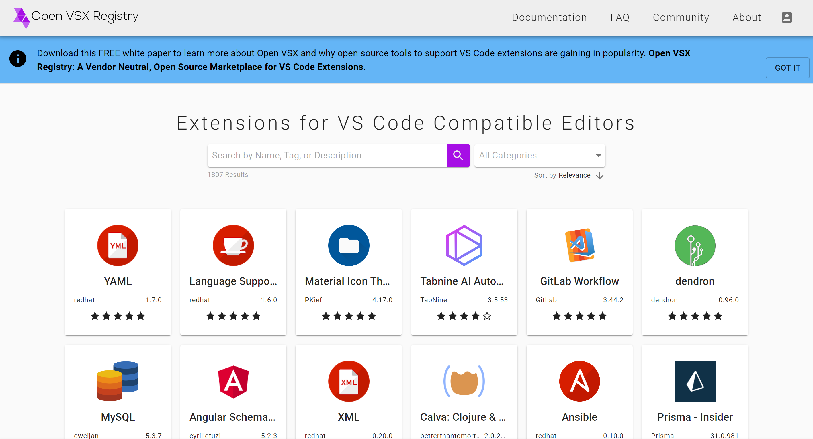
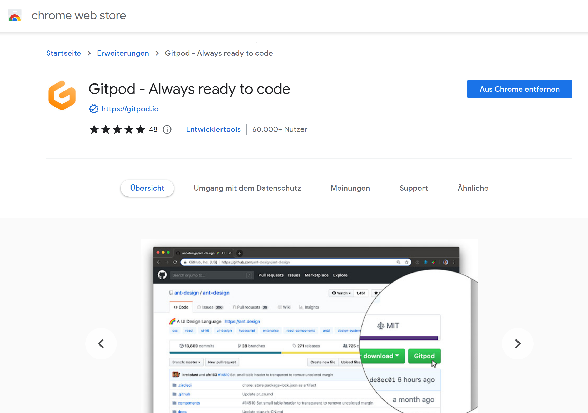
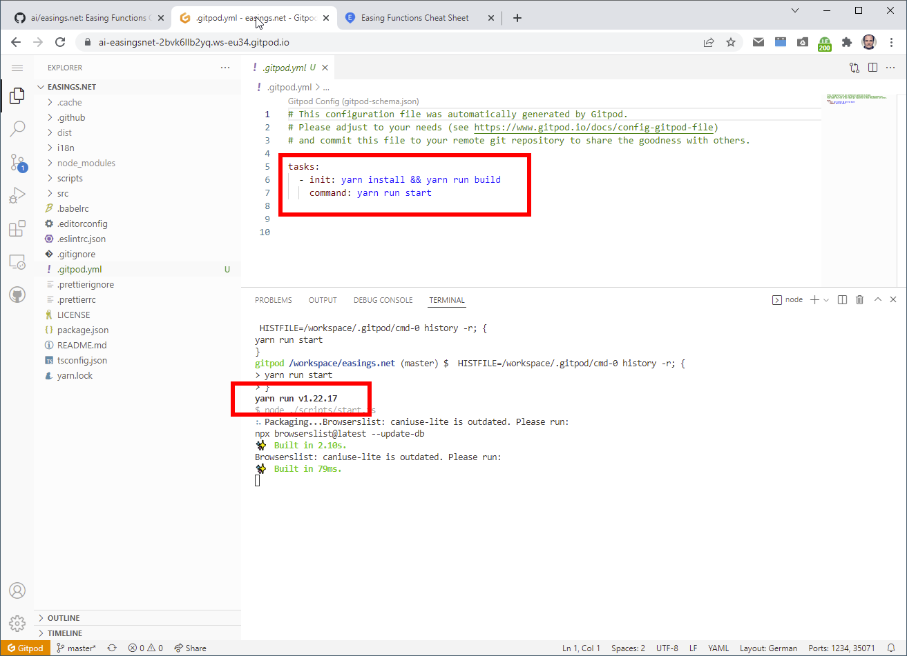
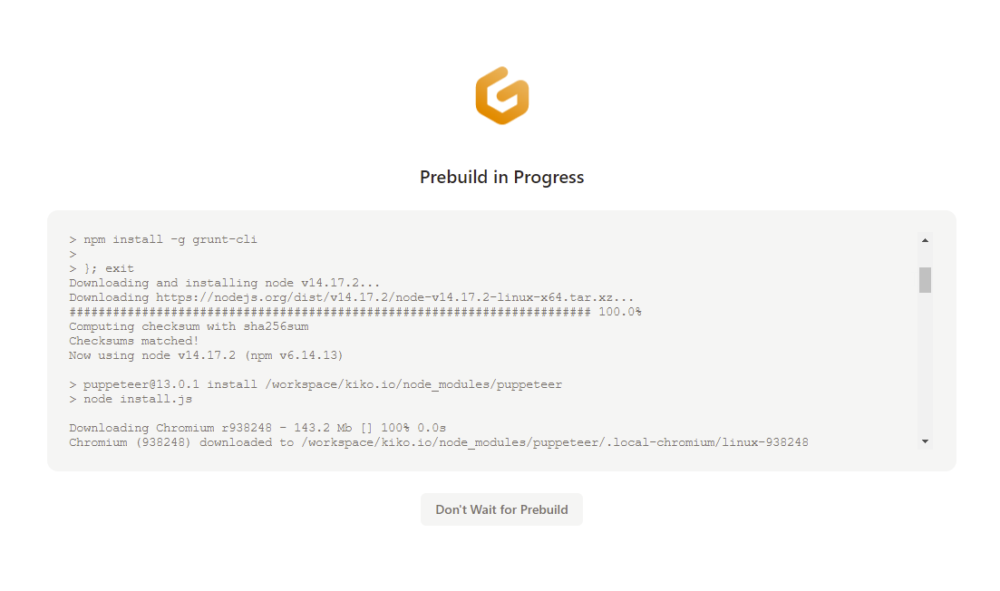
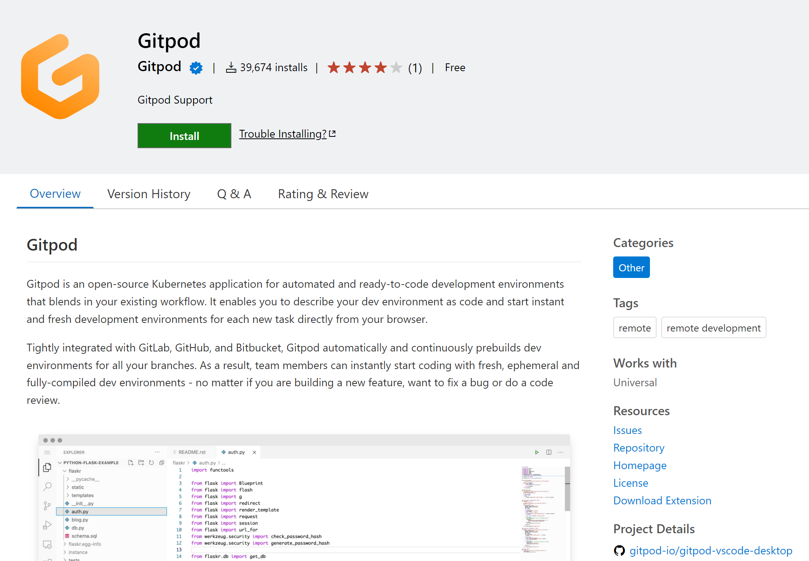

**Der populäre Code-Editor erobert den Browser und die Remote-Arbeit und das Kieler Unternehmen Gitpod ist mit ihrer Lösung ganz vorne mit dabei**

Es ist schon erstaunlich wie schnell der Editor **[Visual Studio Code](https://code.visualstudio.com/)** (VS Code) die Entwicklergemeinde erobert hat (Platz 1 im Stack Overflow Developer Survey Ranking 2021) und auch jene aus der Linux-Fraktion, die Microsoft historisch bedingt, aber aus gutem Grund, eher kritisch gegenüberstehen. Der Konzern aus Redmond hat mit dem Tool ziemlich viel richtig gemacht und eine große Schar an Open-Source-Entwicklern um sich versammelt (aktuell 1.640 Contributors), die dazu beitragen, dass das schweizer Microsoft-Team um Erich Gamma alle paar Wochen ein neues Release für Windows, Linux und macOS herausbringen kann.

Angefangen hat alles mit dem [Monaco Editor](https://microsoft.github.io/monaco-editor/), dem Herzstück um das herum VS Code gebaut ist und das am 14. April 2016 erstmals veröffentlicht wurde. Das spannende an Monaco bzw. VS Code ist, dass es konsequent mit Web-Technologien geschrieben ist, also HTML, CSS und Javascript, verpackt und ausgeführt mittels des von GitHub entwickelten Frameworks [Electron](https://www.electronjs.org/), das widerum auf [Node.js](https://nodejs.org/en/) und der quelloffenen Browser-Engine [Chromium](https://www.chromium.org/Home/) von Google basiert.

Nicht wirklich verwunderlich ist, dass die Entwickler vom Start weg einen richtig guten Editor gebaut haben, der dem damals ersten Chromium-basierten Tool [Brackets](https://brackets.io/) von Adobe direkt die Stirn bieten konnte, denn Erich Gamma war viele Jahre lang Leiter der Entwicklungsumgebung [Eclipse](https://www.eclipse.org/eclipse/) und weiß daher um die Bedürfnisse der weltweiten Entwicklergemeinde. Erstaunlich hingegen ist schon, das obwohl VS Code auf Web-Technologien fußt, es einige Jahre gedauert hat, bis es der Editor aus seinem Electron-Karton heraus, direkt in den Browser geschafft hat. So hat Microsoft erst 2020, 2 Jahre nach der Übernahme von GitHub, [github.dev](https://github.dev/) angekündigt, wobei dies lediglich ein Aufrufziel für den neu eingeführten **Magic Dot** ist und ein auf GitHub gehostetes Projekt im Browser öffnet. Wer es ausprobieren mag: einfach auf irgendein GitHub Repository gehen und die Taste PUNKT drücken und das Projekt öffnet sich in einem VS Code Browser-Fenster. Eine Variante davon ist [vscode.dev](https://vscode.dev/), die nicht nur GitHub-Projekte öffnen kann, sondern jedes beliebige von der eigenen Festplatte.

Beiden Browser-Editoren ist aber eines gemein: man kann wunderbar unterwegs coden, aber starten kann man die Projekte nicht und damit auch den eigenen Code nicht auf Lauffähigkeit validieren. Es fehlt der Unterbau und ist somit keine echte IDE. Kein Pre-Processing via Grunt oder Gulp, kein startender Web-Server oder Ähnliches, schlicht weil es keine Konsole gibt, die mit Betriebssystem kommunizieren könnte. Microsoft hat aber 2020 auch ein weiteres Tool angekündigt, dass genau diesen Unterbau via Cloud-Container mitbringen soll: [GitHub Codespaces](https://github.com/features/codespaces). Seit ein paar Wochen werden die Beta-Zugänge ausgeweitet und ab August soll es für Team und Enterprise Cloud-Pläne verfügbar sein.

## Cloud-basierte Entwicklungsumgebung aus Kiel: Gitpod

Ein Team um Sven Efftinge und Anton Kosyakov aus dem schönen Kiel, haben sich die Frage, warum nicht eine Online-Entwicklungsumgebung bauen, bereits 2017 gestellt und das Projekt Theia unter dem Dach der Eclipse Foundation ins Leben gerufen. Die Idee war eine Remote-First IDE zu entwickeln, die sowohl lokal als auch im Browser läuft und die bereits zahlreich vorhandenen VS Code Erweiterungen voll unterstützt. Das eigentliche Produkt um Theia herum nannten sie **Gitpod** ([gitpod.io](https://gitpod.io/)). Obwohl es noch heute zahlreiche Theia-Lösungen wie Eclipse Che, Stackblitz oder den Google Cloud Shell Editor gibt, hat sich Gitpod Ende 2020 entschieden zur VS Code Plattform zu wechseln, nachdem Erich Gamma und sein Team den [Remote Support in VS Code](https://code.visualstudio.com/docs/remote/remote-overview) zur Verfügung gestellt hatten, auf dem u.a. github.dev basiert.

Da sich Microsoft aber entschieden hatte, die Server-Komponente zunächst nicht unter Open-Source zu stellen (das kommerzielle GitHub CodeSpaces lässt grüßen), hat Anton eigenen Angaben zur Folge in 4 Tagen eine erste Arbeitsversion des [Open VSCode Servers](https://github.com/gitpod-io/openvscode-server/) erstellt, der im [September 2021 veröffentlicht](https://www.gitpod.io/blog/openvscode-server-launch) wurde. Zwar hat Microsoft nicht einen Monat später die eigene Server-Lösung ebenfalls frei verfügbar gemacht, aber mit ein paar Einschränkungen u.a. bezüglich der Erweiterungen, die bei Gitpod über das Portal [Open VSX Registry](https://open-vsx.org/) beziehbar sind, da der [Microsoft Extension Marketplace](https://marketplace.visualstudio.com/vscode) für Microsoft eigene Produkte vorbehalten ist.



## Der Name und die Technik dahinter

Der Name **gitpod** verrät schon einiges über die Technik hinter dem Dienst. 'git' steht für das System der Dateiverwaltung hinter dem Editor und 'pod' für die Server-Technik unter dem Editor.

### git...

Quellcode liegt heutzutage (hoffentlich) nicht mehr nur lokal auf einer Festplatte, sondern zentral und verwaltet durch eine Quellcode-Management-Software. Der momentane Goldstandard in diesem Bereich ist das von Linus Torvalds 2005 initiierte freie [Git](https://de.wikipedia.org/wiki/Git), einer verteilten Versionsverwaltung, die die Basis von populären Entwickler-Plattformen wir GitHub, GitLab oder Bitbucket darstellt.

### ...pod

Dazu kurz einen Schritt zurück in der Zeit: Es ist noch gar nicht so lange her, da nannten IT'ler eine Umgebung auf der sie eine Server-Anwendung veröffentlichten *Maschinen*, weil es dafür zunächst Hardware (ugs. "Blech") mit Prozessor, Hauptspeicher, Festplatten und dergleichen brauchte, auf der dann ein Betriebssystem der Wahl und darauf widerum die besagte Anwendung installiert wurde.

Wurde die Server-Anwendung jedoch nur sporadisch genutzt, war die teure Hardware nicht ausgelastet, sprich Ressourcen wurden verschwendet. Um dieses Problem zu beheben, wurde in den 70ern begonnen an der Virtualisierung von Hardware zu arbeiten, damit sich mehrere logisch voneinander getrennte Systeme die Hardware teilen können, um deren Auslastung zu erhöhen. In jeder der so entstehenden [virtuellen Maschinen (VM's)](https://de.wikipedia.org/wiki/Virtuelle_Maschine) kann ein beliebiges Betriebssystem und darin die benötigten Server-Anwendungen installiert und betrieben werden.

In diesem Konzept gibt es aber Redunanzen in Form des Betriebssystems. Will man zum Beispiel auf einem Blech 5 Linux-basierte Web-Server laufen lassen, muss dazu aber auch 5 womöglich identische Ubuntu-Installationen mitschleifen, die gewartet werden wollen.

[Docker](https://de.wikipedia.org/wiki/Docker_(Software)) ist nicht die einzige, aber bekannteste Software, die dieses Problem 2013 angegangen ist, indem es eine weitere Schicht, in diesem Fall das Betriebssystem, abstrahiert. Hier spricht man nun nicht mehr von einer Maschine oder VM, sondern von einem Container, in dem die Server-Anwendung läuft. Für die Orchestrierung dieser Container gibt es seit 2015 die von Google initiierte Software [Kubernetes](https://de.wikipedia.org/wiki/Kubernetes), in der die kleinste einsetzbare Einheit als **Pod** bezeichnet wird, in dem ein oder mehrere Container enthalten sind, die sich die zugeteilten Resourcen teilen.

Ein solcher Pod mit einem fertig installierten und konfigurierten Open VSCode Server wird auf der Google Cloud Platform gestartet, wenn ein Benutzer ein Gidpod Workspace öffnet.

## Los Gehts ... Starten eines Gitpod-Arbeitsbereichs

In Gitpod startet man ein auf Github, Gitlab oder Bitbucket gehostetes Projekt in einen sogenannten Workspace (Arbeitsbereich). Dazu genügt es der Url seines Repositories die Zeichenkette **gitpod.io/#** voranzustellen.

Wer lieber Knöpfe mag, kann entweder ein bereitgestelltes [Bookmarklet](https://www.gitpod.io/docs/browser-bookmarklet) verwenden und auf eine [Browser-Erweiterung](https://www.gitpod.io/docs/browser-extension) zurückgreifen, die einen Gitpod-Button in die Github-Oberfläche einfügt.



Wurde der Arbeitsbereich einmal gestartet und man hat das Browser-Fenster geschlossen, steht er eine zeitlang auf dem Dashboard unter **Workspaces** zur Verfügung. Wenn man häufiger mit ein und demselben Projekt arbeitet, ist es ratsam sich dort unter **Projects** eine dauerhafte Verknüpfung anzulegen, wenn man weder auf manuelle Url-Änderungen oder Knöpfe steht. Das I-Tüpfelchen ist zu guter Letzt die Installation eines dieser Gitpod Projekte als Chrome-App und die Ablage in der Symbolleiste. Damit ist der Code nur einen Klick entfernt und das Ganze fühlt sich aufgrund des reduzierten Browser-Fensters fast so an wie ein lokales VS Code.


## Konfiguration des Arbeitsbereichs eines Projektes

Neben den generellen Einstellmöglichkeiten, bietet Gitpod eine individuelle Konfiguration je Projekt. Dazu wird im Stamm des Projektordners die Datei **.gitpod.yml** gesucht und verwendet. Alle Einstellungsmöglichkeiten sind in den [gitpod Docs](https://www.gitpod.io/docs/references/gitpod-yml) gut dokumentiert.

### Verwendung eines benutzerdefinierten Containers

Der Standard-Container, den Gitpod beim Start eines Arbeitsbereiches hochfährt basiert auf Debian/Ubuntu und enthält bereits eine Menge an Frameworks und Sprachen wie Node, Java, Go, Python und einiges mehr. Wer jedoch ein anderes Image verwenden möchte, kann dies über den Eintrag **image** einstellen, entweder indem man ein öffentliches Images referenziert oder den Namen eines Dockerfiles im Projekt angibt. Die Möglichkeiten hierbei sind zahlreich und im Abschnitt [Custom Docker Image](https://www.gitpod.io/docs/config-docker) zu finden.

### Aufgaben beim Start

Um ein Projekt in Visual Studio Code zum Laufen zu bringen, braucht es gerade im  Node-Umfeld noch ein paar Dinge die eingerichtet werden müssen, wie zum Beispiel die Installation der richtigen Node.js-Version und die der abhängigen Pakete mittels NPM oder einem anderen Paketmanager. Das gleiche gilt natürlich auch für Gitpod, obgleich diese Maßnahmen nach dem Start der Arbeitsumgebung immer wieder durchgeführt werden müssen, wenn zum Beispiel der Pod nach einer Weile verworfen wurde. Für diese wiederkehrenden Aufgaben bietet die Software in der **.gitpod.yml** den [Abschnitt Tasks](https://www.gitpod.io/docs/config-start-tasks) und dort in vorderster Front den Eintrag **init**. Im folgenden Beispiel wird Node 14.17, alle lokalen Pakete und ein globales Paket  als Multi-Line Task installiert:

```
tasks:
  - init: |
      nvm install 14.17.2
      npm install
      npm install -g grunt-cli
```

Mit der Gruppierung und Benennung von Tasks, den Terminal-Anzeigeeinstellungen und den insgesamt drei Ausführungsstufen **before**, **init** und **command** ist es leicht sich eine Konfiguration anzulegen, die den Arbeitsbereich fix und fertig hochfährt und man dabei den Überblick behält.



Wer es noch etwas schneller mag, kann sogenannte [Prebuilds](https://www.gitpod.io/docs/prebuilds) einsetzen, die als Snapshot zur Erstellung eines neuen Arbeitsbereiches dienen. Diese Prebuilds verwenden die **.gitpod.yml** des Projekts und sind eng mit der verwendeten Quellcode-Verwaltung (derzeit GitHub, GitLab und Bitbucket) verknüpft. So wird ein Prebuild jedes mal neu erstellt, wenn veränderter Code in das Projekt eingecheckt wird. Schneller und bequemer von überall im Browser zu Coden geht kaum.



### Erweiterungen automatisch einbinden

Bei der Erstellung des gitpod Arbeitsbereichs lassen sich über die Konfigurationdatei **.gitpod.yml** auch die Visual Studio Code-Erweiterungen einbinden, die man zum Arbeiten braucht. Am einfachsten geht das, wenn die Erweiterung auf der offenen Plattform [Open VSX Registry](https://open-vsx.org) vertreten ist, da gitpod standardmäßig dort nach dem Muster ``${publisher}.${name}`` sucht.

Beispiel:

```
vscode:
  extensions:
    - HookyQR.beautify
    - kamikillerto.vscode-colorize
```

Es lassen sich aber auch VSIX-Dateien aus anderen Quellen über die vollständige Url einbinden. Microsoft bietet mit dem [Visual Studio Marketplace](https://marketplace.visualstudio.com/) zwar die primäre und größte Quelle an Erweiterungen an, verzichtet aber leider auf die Angabe eines kompletten Download-Pfades der VSIX-Datei. Man kann diesen aber anhand des nachfolgenden Musters sehr einfach nachbauen:

``https://${publisher}.gallery.vsassets.io/_apis/public/gallery/publisher/${publisher}/extension/${extension}/${version}/assetbyname/Microsoft.VisualStudio.Services.VSIXPackage``

Die notwendigen Information zu den Variablen *Publisher*, *Extension* und *Version* in diesem Muster erhält man über die Detailseite einer Erweiterung in Visual Studio Code.


Ausgabe:

```
Name: vscode-hexo-utils
Id: fantasy.vscode-hexo-utils
Description: vscode extension for hexo
Version: 0.2.1
Publisher: fantasy
VS Marketplace Link: https://marketplace.visualstudio.com/items?itemName=fantasy.vscode-hexo-utils
```

Daraus wird in der **.gitpod.yml** folgender Eintrag:

```
vscode:
  extensions:
    - https://fantasy.gallery.vsassets.io/_apis/public/gallery/publisher/fantasy/extension/vscode-hexo-utils/0.2.1/assetbyname/Microsoft.VisualStudio.Services.VSIXPackage
```

## Einstellungen synchronisieren

Jede IDE sieht anders aus, je nach Geschmack und Vorlieben des davor sitzenden Entwicklers und so gab es relativ schnell nach der ersten Veröffentlichung von VS Code die ersten Erweiterungen, die die Einstellungen der IDE über mehrere Maschinen hinweg synchronisieren konnten (meist über Gists), bis Microsoft sich des Features annahm und es direkt in die IDE integrierte. Nun haben wir mit Gitpod eine neue, aber etwas anders geartete Instanz von Visual Studio Code, aber auch daran haben die Kieler gedacht. Auf die Daten der integrierten Synchronisation konnten sie zwar nicht zugreifen, aber sie haben mit einer eigenen Erweiterung einen By-Pass geschaffen, der genauso gut funktioniert.  

Nach der Installation in VS Code und einem Neustart desselben, meldet man sich an der Erweiterung mit dem gleichen Konto an, unter dem man sich bei Gitpod registriert hat und kann danach neben den Einstellungen auch Aufgaben, Code-Snippets Erweiterungen und Tastaturkürzel synchronisieren lassen.



## Preise und Leistungen

Gitpod ist ein Unternehmen und muss wie alle anderen schauen, wie sie kostendeckend arbeiten kann. Daher gibt es wie so oft verschieden ausgebaute Pläne die man buchen kann. Es gibt bei Gidpod im Saas-Bereich vier davon, wobei sich Free von den anderen Plänen lediglich in der möglichen Rechenzeit, dem Timeout und der parallel laufenden Workspaces unterscheidet. So sind es im Free-Plan 50 Stunden, die man mit 4 WorkSpaces arbeiten kann und bei Inaktivität werden die Pods nach 30 Minuten wieder heruntergefahren. Ein faires freies Angebot für all jene, die mal unterwegs coden wollen, aber die meiste Zeit über einen Rechner und ein lokal installiertes VS Code verfügen.

Man kann Gitpod aber auch selbst auf einer bestehenden Managed Kubernetes-Umgebung hosten, zum Beispiel wenn man bereits Kunde von Cloud-Dienstleistern wie Amazon, Azure oder Google ist.

## Fazit

Es wird spannend sein zu sehen, inwieweit sich das Microsoft-eigene GitHub CodeSpaces gegen diesen wirklich sehr gut handhabbaren Gegenspieler wird behaupten können, wenn es denn mal in der Masse an den Start gegangen ist. Das Team aus Kiel hat zumindest schon einmal die Latte sehr sehr hoch gehängt, auch weil es fantastisch dokumentiert und strukturiert ist. Ein echter Gewinn für jede Tool-Sammlung.
