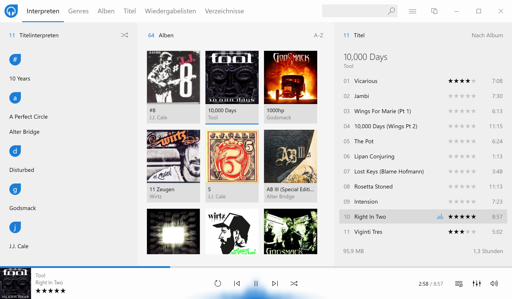
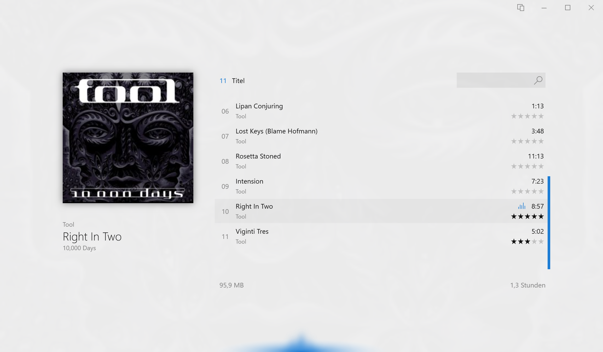
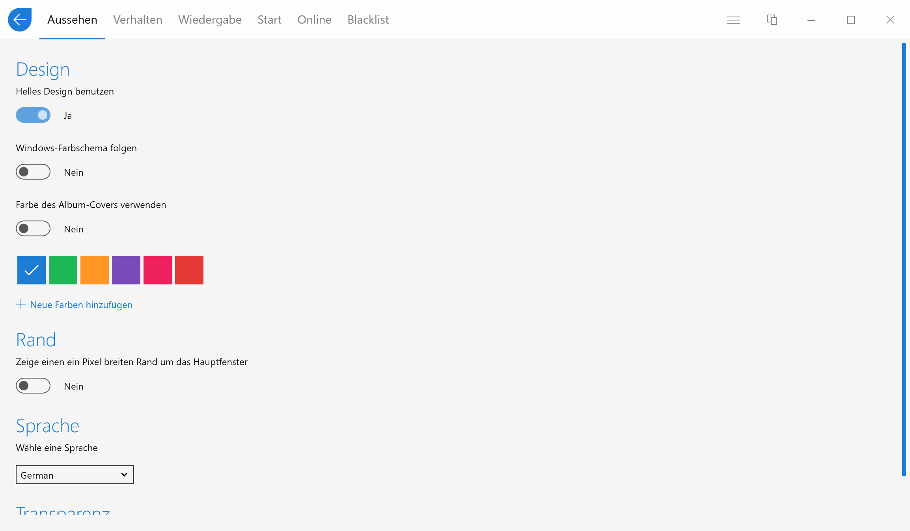
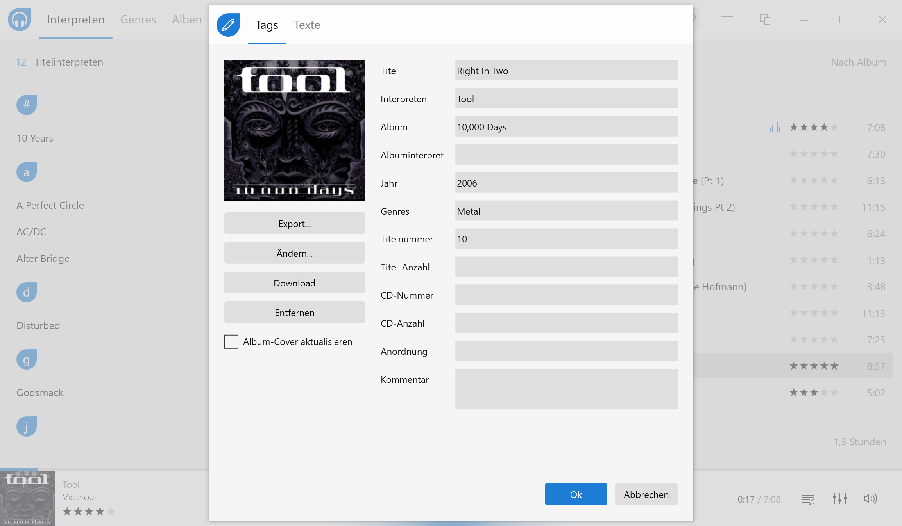
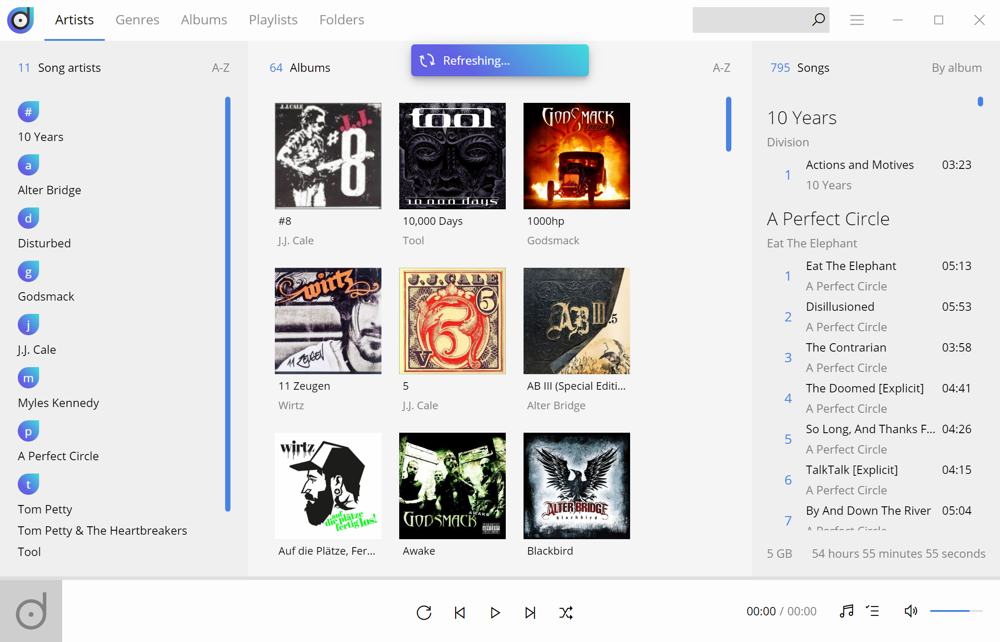

**Ein minimalistischer MP3-Player unter Windows, vertrieben als Open-Source, der auch vor großen Sammlungen nicht zurückschreckt**

Musik-Apps für Smartphones unter Android und iOS gibt es gefühlte drölfzig Millionen. Die meisten davon sind aber relativer Schrott oder versuchen den Usern Malware unterzujubeln. Da muss man schauen, dass man die Spreu vom Weizen trennt. Unter Windows, das deutlich ältere Betriebssystem, sieht das hingegen erstaunlicherweise ganz anders aus. Die Älteren von uns werden sich zwar noch die glorreichen WinAmp-Zeiten erinnern, dessen derzeitiger Besitzer Radionomy seit 2018 einen sehr langen neuen Anlauf für eine neue Version 6 nimmt (Version 5.8 ist bereits stattliche 6 Jahre alt), aber man kann die guten Musikspieler für Windows 10 und höher tatsächlich an einer Hand abzählen, wenn man die Streaming-Apps wie Spotify und Co. abzieht und alles außer acht lässt was als eierlegende Wollmilchsau daherkommt und AUCH MP3 abspielen kann. Die bekanntesten sind der in Windows enthaltetene und kläglich gescheiterte iTunes-Klon von Micosoft namens **Groove**, **[AIMP](https://www.aimp.ru/)**, **[foobar2000](https://www.foobar2000.org/)**, **[MediaMonkey](https://www.mediamonkey.com/)** und **[MusicBee](https://www.getmusicbee.com/)**. Manch ein Nostalgiker mag auch den guten alten [Windows Media Player](https://support.microsoft.com/en-us/windows/get-windows-media-player-81718e0d-cfce-25b1-aee3-94596b658287) hinzuzählen, der es trotz Groove geschafft hat im Netz zu überleben. Wenn man sich die Download-Seiten dieser Musikspielerkandidaten so anschaut und versucht hinter das Geschäftsmodell zu blicken, bleibt auch bei so manchem der Download schlicht aus. Auch übertreibt es der ein oder andere Player mit der Featuritis. Zur Musik hüpfende Bälle oder Balken sind längst überholt geglaubte Gimmiks, wo es doch eigentlich nur darum geht Musik zu hören.

Das sah der belgische Software-Entwickler **Raphaël Godart** ([twitter.com/RaphaelGodart](https://twitter.com/RaphaelGodart)) vor etichen Jahren wohl ähnlich, als er sich anschickte einen eigenen Player für lokale MP3-Sammlungen auf den Markt zu bringen, was sich in diesem Fall falsch kommerziell anhört, denn sein Player **[Dopamine](http://www.digimezzo.com/software/)** ist frei auf GitHub verfügbar und Open-Source unter GPL-3.0-Lizenz. Er spielt unter einer schlichten und einfachen, aber trotzdem schicken Oberfläche Musik ab... Punkt. Alles was das Musikliebhaberherz aber so grundsätzlich begehrt ist an Bord:

- Automatisches Einlesen eines zu Beginn konfigurierten Ordners
- Anzeige der Sammlung nach Intepreten, Genre, Alben, Titel oder Ordner
- Verwaltung von Wiedergabelisten
- Helles und dunkles Theme, inkl. Festlegen der Akzentfarbe
- Oberfläche in 30 Sprachen
- Integration in Task- und Benachrichtigungsleiste
- Automatische Updates

Das Design der Anwendung überzeugt augenblicklich. Alles auf Nötigste beschränkt, eine Akzentfarbe und eine Menge Weiß- bzw. Grauraum, damit sich nicht nur das Ohr ob der Musik, sondern auch das Auge wohlfühlt. Und das bei einer sehr guten Geschwindigkeit und nett animierten Übergängen von einer Ansicht in eine andere.

Neben der Grundfähigkeit MP3-Dateien abzuspielen, hat der Autor auch eine rudimentäre, aber gut funktionierende Bearbeitungsfunktion der MP3-Metadaten eingebaut. Zudem werden etwaige Sternchenvergaben oder hinzugefügte Liedtexte direkt in der Datei und nicht nur in der dahinterstehenden SQLite-Datenbank abgelegt.

Ein paar sinnvolle Dinge aus der Abteilung Featuritis hat Godart allerdings auch in seinem Programm untergebracht. Zum einen lädt es Infos von last.fm zum aktuell gespielten Interpreten nach und man kann auch dorthin scrobbeln wenn man mag und zum anderen durchforstet es einige Lyric-Sammlungen nach dem Liedtext, was aber leider selten funktioniert.

Ziemlich einzigartig ist eines der zuletzt hinzugefügten Features: eine Blacklist! Ja, so manches Album eines Liebslingsmusiker enthält ein Stück, welches er sich besser gespart hätte. Solche Stücke lassen sich nun gezielt ausblenden, damit der Musikgenuss nicht getrübt wird.

## Weiterentwicklung

Neue Releases von Dopamine 2 kommen seit Version 2.0.8 nicht mehr ganz so häufig wie früher, da das Programm im Grunde ausentwickelt ist und Raphaël nur kleinere Features, Übersetzungen und Bugfixes nachschiebt. Stattdessen hat er 4 Jahre nach der Veröffentlichung der ersten Version vor zwei Jahren mit der Version 3 einen vollkommene Neuentwicklung in Angriff genommen. Wo Dopamine bis Version 2 mit Microsoft C# und WPF (Windows Presentation Foundation) entwickelt wurde, wird die neueste auf Electron, Angular and Typescript basieren, also verpackte Web-Technik (HTML, CSS und JavaScript) für alle Betriebssysteme und nicht nur Windows. Aktuell ist Godart bei Preview 10 angelangt, die bei weitem noch nicht den gleichen Umfang der Vorgängerversion hat, aber bereits stabil läuft.

## Musik in der Cloud

Wer unterwegs ist und die eigene Musik auf einem Cloud-Dienst wie OneDrive von Microsoft abgelegt hat, achtet vielleicht darauf, dass auf einem damit verbundenen Gerät nicht die komplette Sammlung heruntergeladen wird, sondern nur ausgewählte Teile, um lokalen Speicherplatz zu sparen. Microsoft macht es den Benutzern da einfach: Es zeigt alle OneDrive-Dateien im Windows Explorer mit 0 Byte benötigtem Speicherplatz an und lädt sie erst dann herunter, wenn auf sie zugegriffen wird oder wenn der Benutzer im Kontextmenü eines Ordners *Immer auf diesem Gerät beibehalten* auswählt. Das funktioniert mit Dopamine 2 ganz wunderbar. Es ignoriert mit Unterstützung von C# und des Betriebssystems beim Scannen des festgelegten Musikordners einfach all jene Dateien, die nicht auf der Platte real verfügbar sind. Dopamine 3 hingegen, in dem der Scan über Node.js und die Methode ``fs.readdir()`` stattfinden muss, triggert dabei sofort die Download-Funktion von OneDrive und man spült sich ungewollt die Platte voll.

## Kuriosität am Rande

Raphaëls C#/WPF-Lösung ist im installierten Zustand 76 MB schwer, davon 2,5 MB für die Executable, die neue Electron-basierte unter Windows allerdings schon 302 MB, wobei die EXE satte 128 MB groß ist. Schaut man sich die Codebasis an, wird das noch augenfälliger: kommt die reine Windows-Variante mit 760 Dateien daher, sind es in der neuen Electron-Version nach Ausführung von ``npm install`` bereits satte 86.092 Dateien in 7.948 Ordnern mit einem Gesamtgewicht von knapp einem Gigabyte! Da sieht man einmal mehr, dass Plattformunabhängigkeit in der schönen neuen Node.JS-Welt nicht selten mit Schwergewichtigkeit erkauft wird. Das liegt vor Allem an der Notwendigkeit (oder der Unart, je nachdem wie man es sieht) zig-tausende abhängige Bibliotheken (Dependencies) mitzuschleppen, die vereinzelt nur einen String auf eine bestimmte Breite bringen oder etwas ähnlich Triviales. Von den Problemen mit depublizierten oder Malware-verseuchten Dependencies, die in letzter Zeit weite Teile der Community in Aufregung versetzt haben, ganz zu schweigen.

## Fazit

Dopamine 2 ist ein wirklich fantastischer Musik-Player für Windows, der die meisten anderen aufgrund der Simplizität und gelungenen Oberfläche schlicht in den Schatten stellt. Mal sehen, ob Godard es schafft mit der Version 3 und Electron etwas Ähnliches hinzubekommen. Eine Herausforderung ist es allemal, aber darauf scheint er als Vollblutentwickler zu stehen. Chapeau Raphaël...
