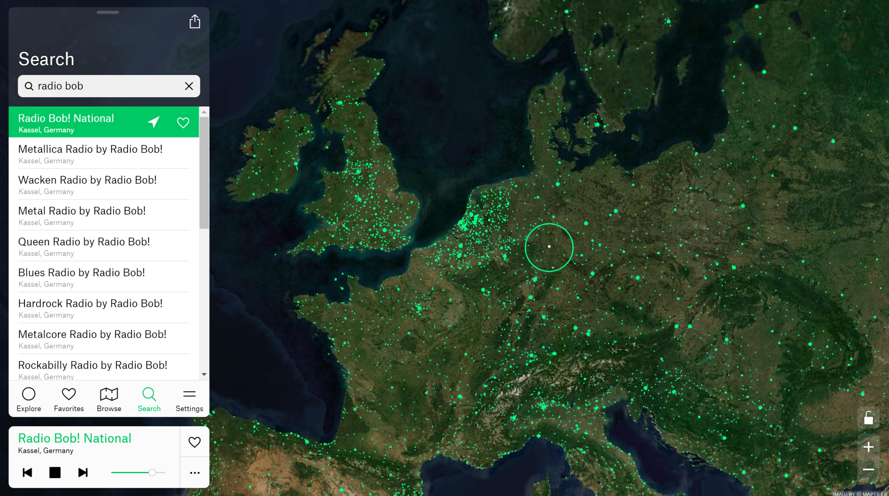
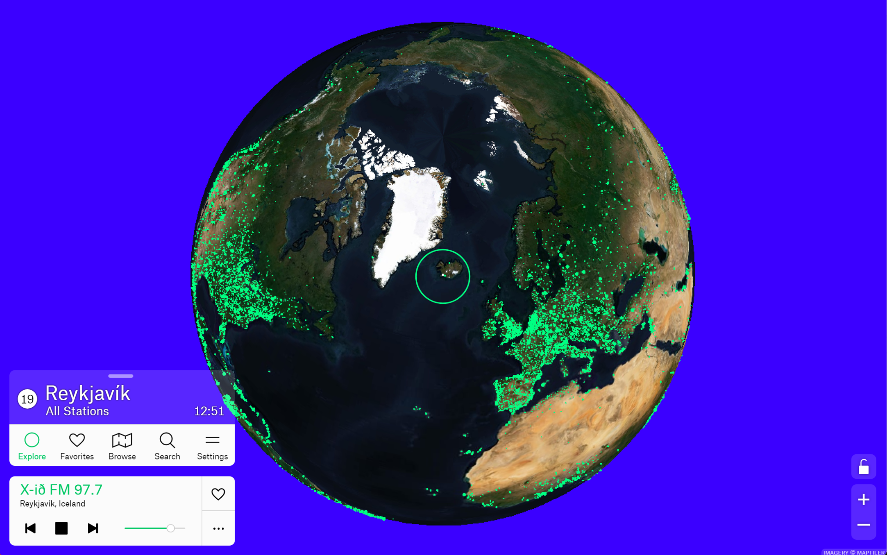
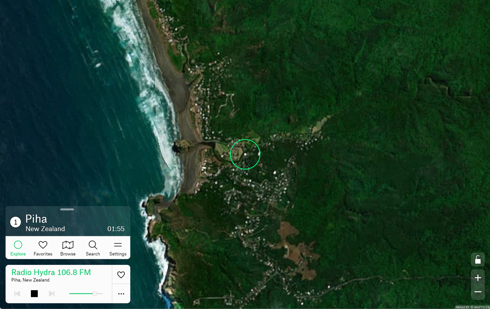
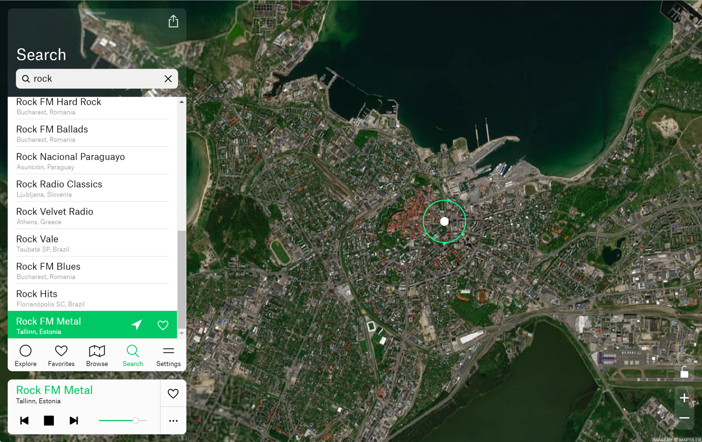

**TEASER**

Das Medium Radio erscheint manchmal so alt wie Menschheit. Dabei nahm der erste Radiosender der Welt, der ein regelmäßiges Programm sendete, erst 1909 in San José seinen Betrieb auf und die erste Station in Deutschland Funk-Stunde Berlin AG startete erst vor ziemlich genau 100 Jahren.

In Zeiten von Streaming-Diensten wirkt Radio trotzdem wie aus der Zeit gefallen. Auch wenn wir es oft nicht bemerken, so umgibt uns Radio doch ständig. Im Auto, in den Öffies, am Arbeitsplatz oder einfach zu Hause in der Küche. Es ist immer noch ein sehr starkes Medium, vielleicht auch deswegen, weil es uns Musik präsentiert, die wir zuvor vielleicht noch nicht gehört haben, abseits unserer gerahmten Playlisten auf Spotify oder iTunes. Neue Künstler oder ganze Musikrichtungen für sich neu zu entdecken geht am einfachsten, wenn man sich aufs Geradewohl einen Radiosender herauspickt. Gerade diese Nichtkontrolle, diese Ausgeliefertsein an die Vorlieben und Vorgaben eines Radioredakteurs, das manchmal Unverhersehbare macht für viele den Reiz dieses "alten" Mediums aus. Radio ist dabei sehr divers und die meisten Sender haben sich auf eine bestimmte Musikrichtung spezialisiert: Rock, Pop, Klassik oder einfach nur Dauernachrichten. Für jeden Geschmack und Stimmung ist etwas dabei.

Die Gerätschaften und Übertragungsmethoden sind heute vielfältiger denn je. Hatte man Ende der 40er gerademal einen alten Volksempfänger und drehte fleißig an den Knöpfchen für den besten terrestrischen Empfang des lokalen Senders, hat das Internet auch die Grundlagen des Radios entscheidend verändert. Weltweites digitales Streaming ermöglicht es, in sehr guter Qualität der Musikzusammenstellung eines "Radio Jockeys" aus Kuala Lumpur, Reykjavík oder Sao Paulo zu hören. Es sprengt die Grenzen, denen Lang-, Mittel- oder Kurzwellensender jahrzehntelang unterworfen waren. So spielen terrestrische Übertragungen wie UKW oder auch DAB zwar auch heute noch eine Rolle, aber Internet-Streaming eröffnet den Menschen in Bezug auf Verfügbarkeit und der verwendeten Geräte vollkommen neue Möglichkeiten. Heute reicht ein Smartphone, um sich von den sphärischen Klängen eines indischen Esotherik-Senders in andere Welten entführen zu lassen oder um das Haupthaar im Takt zu den harten Metal-Klängen eines estnischen Rocksenders mal richtig durchzuschütteln. Alles nur einen Tap entfernt.

Wie so oft in der modernen Welt, ist es auch hier das Überangebot, das manche verwirrt und frustriert zurücklässt. Man muss erstmal in der Lage sein, das was man mögen könnte aus dem gigantischen Heuhaufen der Möglichkeiten herauszupicken. Aber wie im Internet üblich, gibt es auch für die Senderauswahl Helferlein, die mehr oder minder unabhängig Vorschläge unterbreiten, was man so hören könnte.
Eines davon sticht jedoch aus der Masse heraus, weil es zum einen keine kommerziellen Interessen verfolgt und zum anderen sehr intuitiv an die Sendersuche herangeht: Radio Garden (https://radio.garden)

Das Tool, das sehr gut in jedem modernen Browser funktioniert, das es aber auch als Android bzw. iOS App gibt, zeigt zunächst nichts anderes als einen interaktiven Globus dar, auf dem zig zehntausende grüne Punkte unter einem runden Ziel-Cursor hindurchrauschen, wenn man die Karte hin- und herschiebt oder in die Welt hineinzoomt. Nimmt man einen der grünen Punkte ins Visier, wird der Sender der betreffenden Stadt geladen und abgespielt. Gibt es an einem Ort mehrere Sender, erscheint der Punkt größer und man bekommt zusätzlich eine Senderliste dargeboten.

Das ist so intuitiv, das es augenblicklich den Entdeckergeist weckt und man nach Minuten japanische, australische oder peruanische Radiosender anhört und entscheidet, ob sie auch auf die Favoritenliste kommen. Über die Suche findet man nicht nur die heimischen, vertrauten Sender (wenn sie denn einen Internet-Stream anbieten), sondern auch thematische Sender. Im Verzeichnis enthalten sind sogar einige US-Polizeistationen, die Ihren Funkverkehr im Internet streamen.

Hervorgegangen ist Radio Garden aus einem wissenschaftlichen Projekt des Netherland Institute for Sound and Vision in Hilversum, Niederlande, das zwischen 2013 und 2016 untersucht hat, wie Radio in anderen Teilen der Welt klingt und was Grenzen, unterschiedliche kulturelle Identitäten und Begegnung mit Radio macht.

"Das Radio ist überall um uns herum, und es ist zu Hause, es ist nicht mehr die greifbare Präsenz, die es einmal war... wo genau ist das Radio eigentlich?" - Jonathan Puckey

An dem Projekt, beziehungsweise an seiner technischen Umsetzung, war maßgeblich der Brite Jonathan Puckey mit seinem Studio beteiligt. Entstanden ist daraus in einigen Iterationsstufen die Web App radio.garden, die Puckey bis heute betreut. Anstelle von Landkarten verwendete das Team aus Amsterdam von Anfang an Satellitenbilder, um zu verdeutlichen, dass Funksignale schon immer die Kraft hatten, Grenzen zu überschreiten.

Radio Garden ist kostenlos und man braucht keine Registrierung, kein Login oder auch nur die Angabe einer Mail-Adresse. Nichts. Aufmachen, Sender wählen, Radio hören.

Leider gibt es auf der Welt aber auch ein paar Regionen, die die Website radio.garden oder die Apps nur eingeschränkt nutzen können. So gab es in den Antworten eines Mastodon-Posts zum Thema einige Reaktionen aus Großbritannien, die nicht einen Sender außerhalb ihrer Insel ansteuern konnten. Dieses Problem scheint einen lizenztechnischen Hintergrund zu haben und somit eine Brexit-Auswirkung zu sein, aber offizielle Statements gibt es leider dazu nicht. Ähnlich in der Türkei, wo der Dienst laut Wikipedia eingestellt wurde, nachdem das dortige Radio and Television Supreme Council den Betreiber zu Lizenzzahlungen aufgefordert hat. Umgehen lassen sich diese Beschränkungen wohl nur über die Nutzung eines VPN's in einem anderen Land.

Es macht einen unheimlichen Spass über den Globus zu streifen und zu versuchen einer indonesischen Nachrichtensendung zu folgen oder zu erraten welche Produkte die Werbung eines griechischen Senders zu verkaufen sucht oder einfach nur in die musikalische Welt Indiens einzutauchen. Radio Garden ist ein sehr spannendes Projekt, wunderbar präsentiert.
