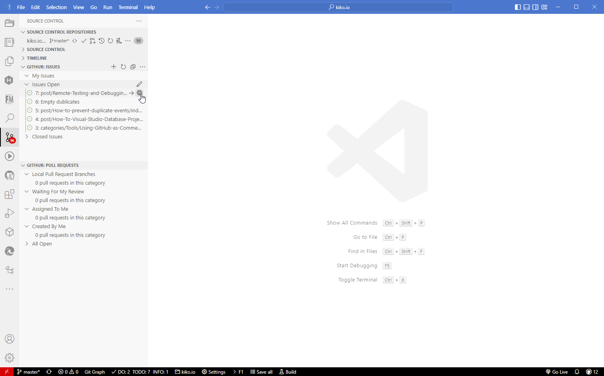
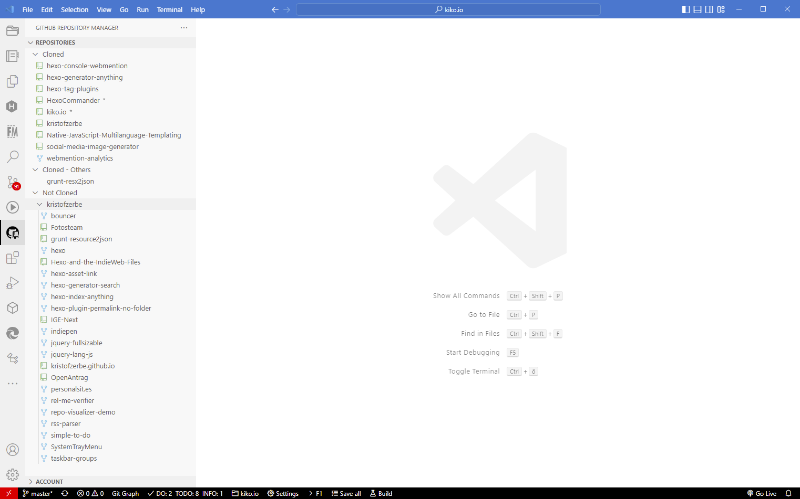
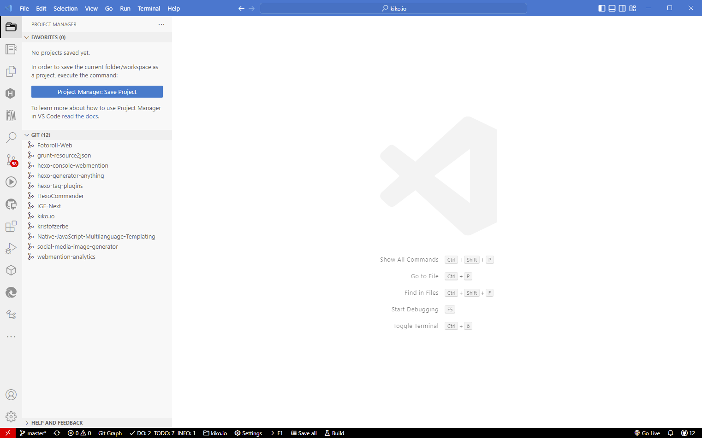
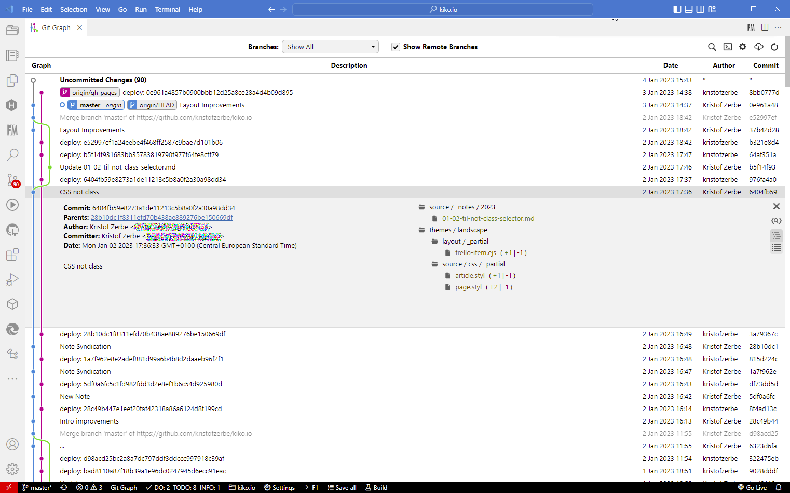
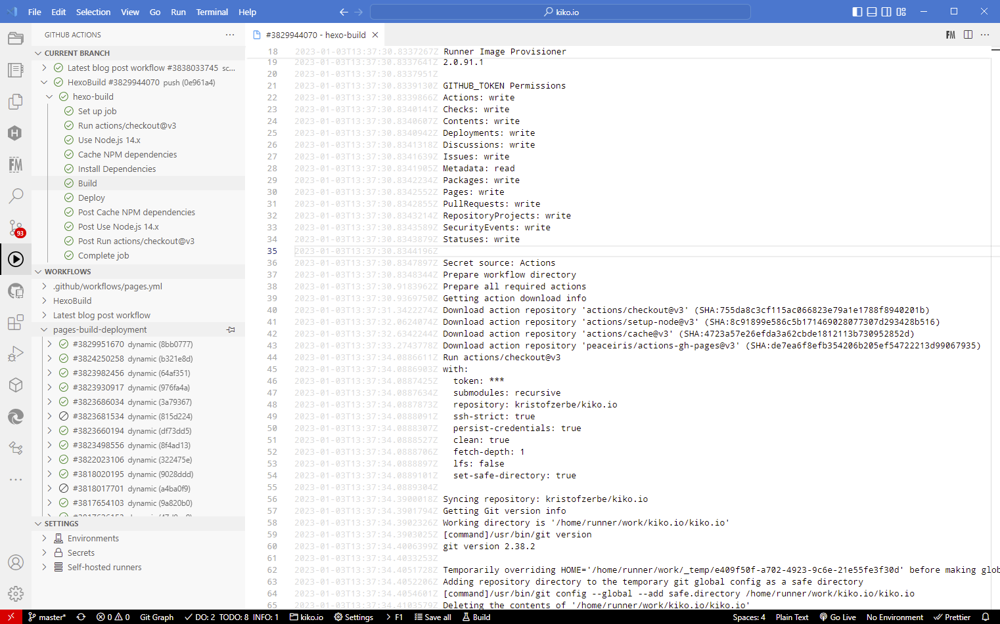
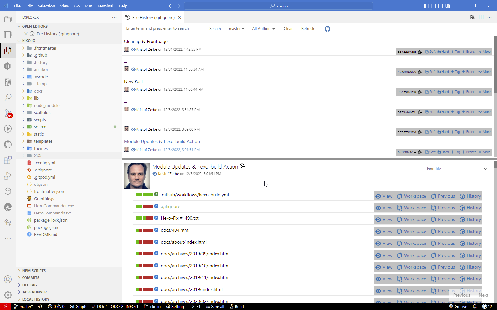
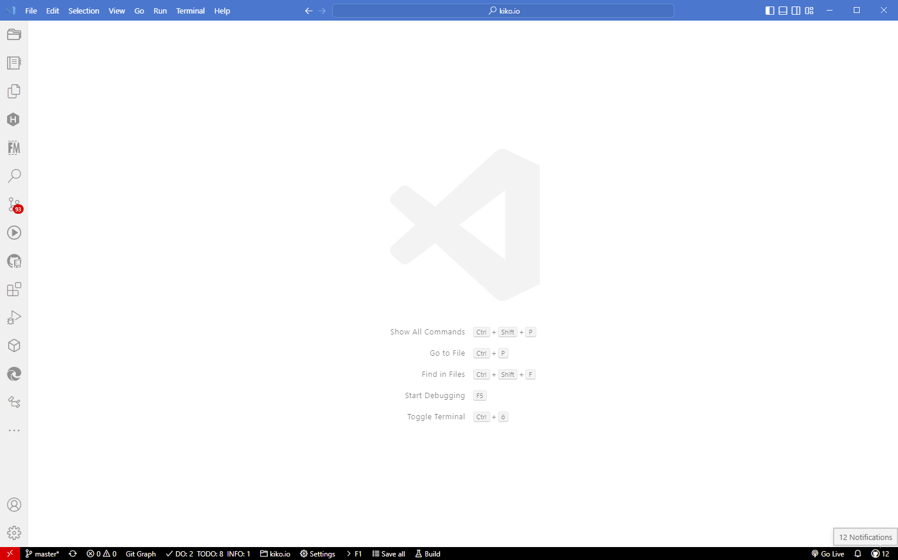
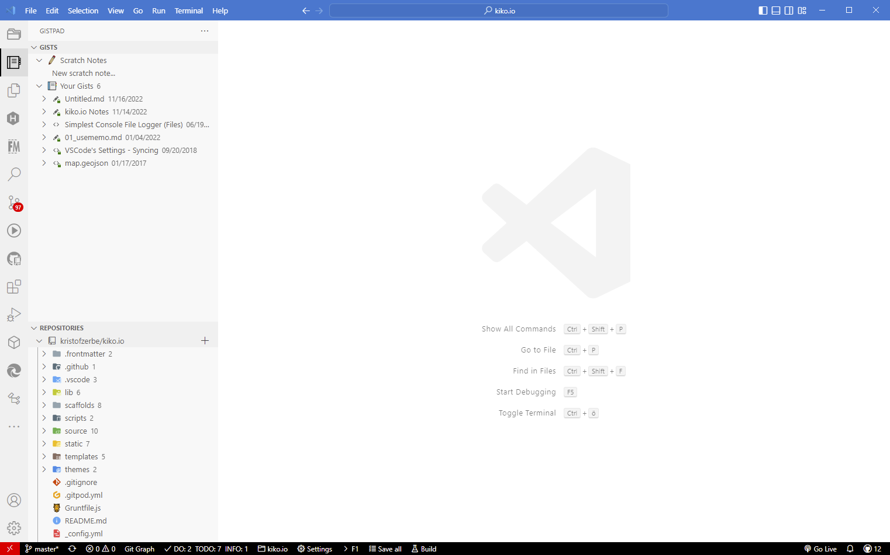

**An Visual Studio Code und GitHub kommt ein Entwickler heute kaum noch vorbei. Mit den richtigen Plugins wird es so richtig bequem.**

Es gibt kaum eine Entwicklungsumgebung, gerade für Web-Projekte, die einen steileren Nutzungsgrad hingelegt hat als Microsofts Visual Studio Code oder VS Code. Seit dem Erscheinen der ersten Version 2016 vergeht kaum ein Jahr wo es in den einschlägigen Rankings nicht Platz 1 einnimmt. Mit dem Kauf von GitHub 2018 hat sich Microsoft ein weiteres unverzichtbares Schwergewicht im Bereich Software-Entwicklung ins Portfolio gelegt. Beide zusammen bilden aktuell so das Nonplusultra, auch weil Microsoft es versteht die beiden Tools gut ineinander zu integrieren und das mit Hilfe einer Open-Source-Community, mit der sich Microsoft nach mageren Jahren unter Steve Balmer scheinbar versöhnt hat.

Wie gut und weitgediehen diese Integration von VS Code und GitHub inzwischen funktioniert, zeigen nicht zuletzt webbasierte Produkte wie das hauseigene GitHub Codespaces oder Gitpod, aber das wird bereits berichteten: VISUAL STUDIO CODE IM WEB MIT GITPOD (https://www.golem.de/news/visual-studio-code-im-web-mit-gitpod-ein-gewinn-fuer-jede-tool-sammlung-2207-166061.html). Das diese Symbiose aus Browser, Code-Editor und Quellcode-Verwaltung nicht nur die Effizienz der Software-Entwicklung steigert, sondern ebenfalls Microsofts Cloud-First-Ambitionen und damit den Azure-Umsätzen dient ist offensichtlich und versteht sich von selbst.

Aber auch abseits der Cloud, auf den Festplatten der Entwickler, bleiben kaum Wünsche offen. Und wenn die Standardintegration in VS Code mal was nicht kann, dann springen Plugins in die Bresche von denen wir hier ein paar mehr oder minder essentielle vorstellen möchten.

# GitHub Pull Requests and Issues

Autor: GitHub  
Quelle: https://marketplace.visualstudio.com/items?itemName=GitHub.vscode-pull-request-github

# GitHub Repository Manager

Autor: Henrique Almeida, Österreich  
Quelle: https://marketplace.visualstudio.com/items?itemName=henriqueBruno.github-repository-manager

# Project Manager

Autor: Alessandro Fragnani, Brasilien  
Quelle: https://marketplace.visualstudio.com/items?itemName=alefragnani.project-manager

# Git Graph

Autor: Michael Hutchison, Australia  
Quelle: https://marketplace.visualstudio.com/items?itemName=mhutchie.git-graph

# GitHub Actions

Autor: Christopher Schleiden, Deutschland  
Quelle: https://marketplace.visualstudio.com/items?itemName=cschleiden.vscode-github-actions

# Git History

Autor: Don Jayamanne (Microsoft)  
Quelle: https://marketplace.visualstudio.com/items?itemName=donjayamanne.githistory

# GitHub Notifications

Autor: Fabio Spampinato, Großbritannien  
Quelle: https://marketplace.visualstudio.com/items?itemName=fabiospampinato.vscode-github-notifications-bell

# GistPad

Autor: Jonathan Carter, USA  
Quelle: https://marketplace.visualstudio.com/items?itemName=vsls-contrib.gistfs

