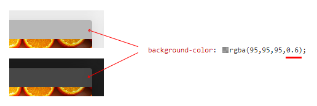

Just for me to remember the next time...

Instead of using two different colors for the light and the dark theme, take ONE matching color and set the transparency to 50-60% via the alpha channel to let the light or dark background shine through.

#CSS #Colors #RGBA

