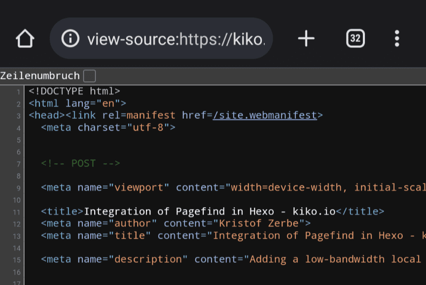

Unfortunately on Android there is no menu item "View Source" if you want to have a look at the HTML code of a page. But there is a way ... just add ``view-source:`` in front of the URL on editing it in the address bar.

#Chrome #Android
