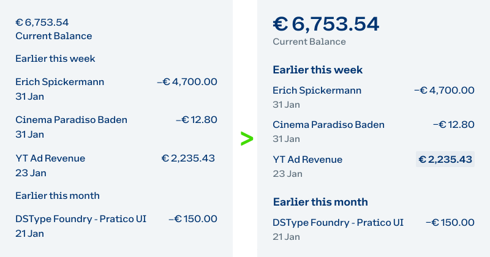

I'm not a designated design specialist, but UI's are and always have been important to me as a visual person. However, all web or other interfaces I designed as a developer were only created based on my feeling whether it looks good to me or not. **Oliver Schöndorfer** in his article about typographic hierarchies translates my simple feeling into psychological contexts (goal, levels, effect) without drifting into science. Very nice and helpful article ...



#Typography #UIDesign

```cardlink
url: https://pimpmytype.com/hierarchy/
title: "Typographic Hierarchy in Print, Web & App Design - Pimp my Type"
description: "Visual hierarchy makes or breaks your design. Learn how to guide the eye by intentionally using contrast and spacing in typography."
host: pimpmytype.com
favicon: https://pimpmytype.com/wp-content/uploads/2021/07/cropped-pmt-favicon-32x32.png
image: https://pimpmytype.com/wp-content/uploads/2023/01/visual-hierarchy-in-typography-print-web-app-ui-design-thumb.jpg
```
