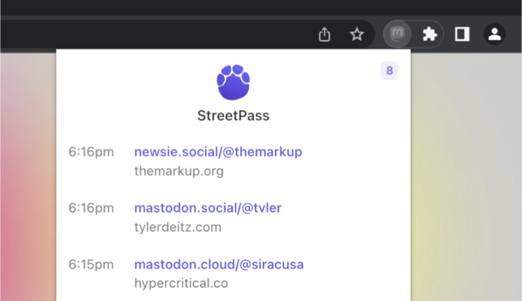

[rel=me](http://microformats.org/wiki/rel-me) links are an important part to verify users on Mastodon, but not every site provides a visible link to follow or you have to search around. **[StreetPass](https://streetpass.social/)** is a little extension for Chromium and FF which collects those REL links while browsing. Extremely convenient
... Thank you [@tvler@mastodon.social](https://mastodon.social/@tvler)

