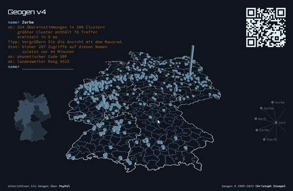

[Christoph Stoepel](https://christoph.stoepel.net/) has created an awesome visualization of the geographical distribution of surnames in Germany. He started this genealogical project back in 2004, but I just stumbled across it now. Interesting to see where most namesakes live...



```cardlink
url: https://geogen.stoepel.net/index.html
title: "Geogen"
host: geogen.stoepel.net
favicon: https://geogen.stoepel.net/favicon-dark.ico
```