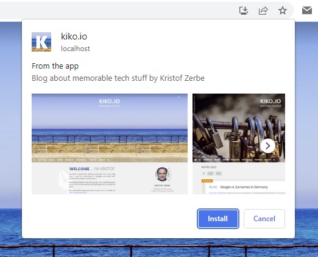

At the end of March, the [Chrome team announced](https://developer.chrome.com/blog/richer-install-ui-desktop/) that they have extended the installation dialog of WebApps/PWAs on desktop and Android systems. To offer the user the new extended dialog it is necessary to include a meaningful description as well as a maximum of 3 screenshots in the manifest.

#Chrome #WebApp #Installation