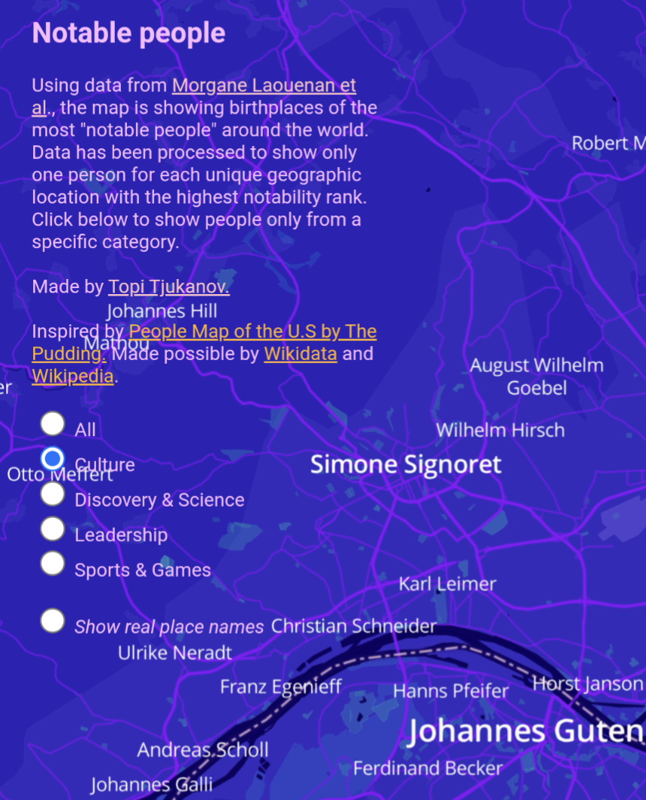

What do Simone Signoret, French actress, and John McEnroe, American tennis player, have in common? They were both born in my hometown of Wiesbaden, Germany. I know this now thanks to Topi Tjukanov, who created an interactive map showing the birthplaces of the world's most famous people.

#map #people



```cardlink
url: https://tjukanovt.github.io/notable-people
title: "Notable people"
host: tjukanovt.github.io
```