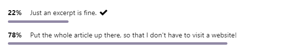

Since this blog has been around, I only display the excerpt of an article on the front page, and that's how I've done it with my Atom feed. Personally, I also like short feed entries when I can briefly skim what it's about.

However, I recently came across a Mastodon poll, where [Sean](https://social.treehouse.systems/@deadsuperhero) wanted to know what readers prefer: excerpt or full article. More than 3/4 of the people said: full article and in the comments some understandable reasons were given.

So I have changed that now...

https://social.treehouse.systems/@deadsuperhero/110608652068691549

#feed #poll
