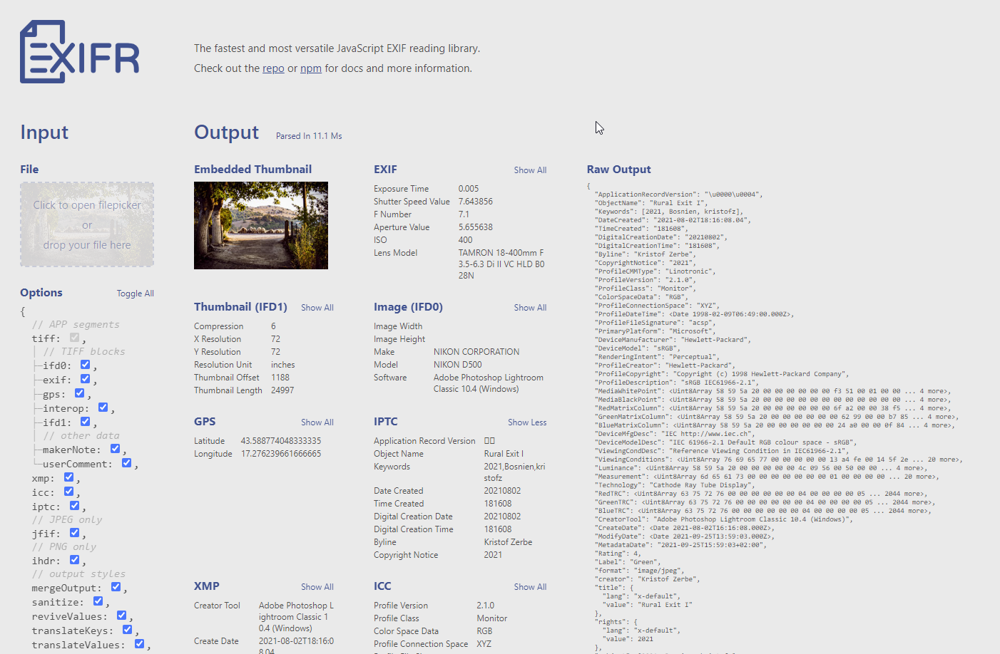

Two hearts live in my chest: web development and photography. When it comes to a combination of the two topics, I get very excited. For a small automation function of my blog, I needed a way to read the EXIF or IPTC data via Node/JavaScript from a JPG image and found EXIFR by [Mike Kovarik](https://github.com/MikeKovarik).

[https://github.com/MikeKovarik/exifr](https://github.com/MikeKovarik/exifr)

This thing not only maps all sorts of image metadata, but is also incredibly fast. There are ESM as well as CommonJS versions and different bundles (full, lite, mini), depending on your needs. 

I have bookmarked Mike's example page, if I need the data of a photo quickly...



#JavaScript #NodeJS #EXIF

```cardlink
url: https://github.com/MikeKovarik/exifr
title: "GitHub - MikeKovarik/exifr: 📷 The fastest and most versatile JS EXIF reading library."
description: "📷 The fastest and most versatile JS EXIF reading library. - MikeKovarik/exifr"
host: github.com
favicon: https://github.githubassets.com/favicons/favicon.svg
image: https://repository-images.githubusercontent.com/143209709/ed4d6b00-02ed-11ea-9beb-5c8f01ae5aaa
```
