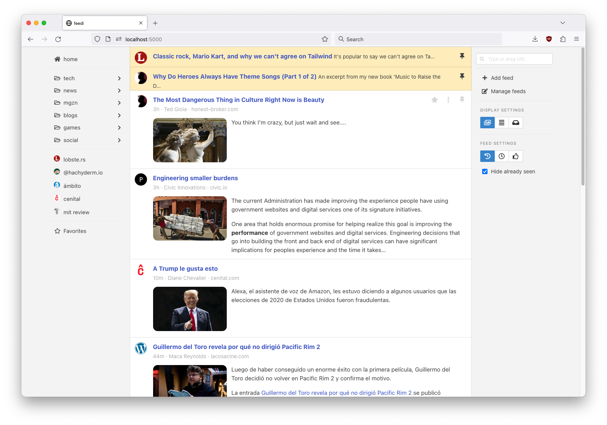

This post grabbed me this morning, because it speaks to me from the soul about the danger of burnout in the IT industry and the joy you get when you can develop something for yourself and no one else. For me in particular, it gets exciting when it has something to do with the #IndieWeb and taking back control of your own data.

I'm not familiar with #Python at the moment, but I know most of the concepts of the language and can read it, so I'm going to set up an instance of #Feedi, the "Personal Reader", and see how far I get. I like the mix of classic #RSS feeds and #Mastodon streams, as well as the ability to easily write my own source parser ... and the well-designed UI. Chapeau for this gem ...

