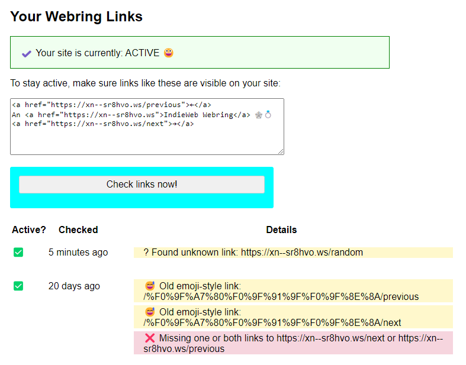

It was an honor to make the IndieWeb Webring a little better with [my hint](/notes/2024/The-fun-of-randomness-in-a-Webring/) and thanks to Marty's quick response I now have my random toy and pastime again ;)

Of course, I immediately added the new ``/random`` link and replaced the old emoji-style links with the normal ones, because Marty's [link checker on the dashboard](https://xn--sr8hvo.ws/dashboard) reminded me to do so. However, the following recheck resulted in a new warning:

> ? Found unknown link: https://xn--sr8hvo.ws/random



:D Marty ... there is still a little something to fix ;)

```cardlink
url: https://martymcgui.re/2024/07/31/103341/
title: "Marty McGuire"
description: "Oh! Dang! Many thanks to Kristof for pointing out a glaring oversight in my recent updates to make the IndieWeb Webring 🕸️💍 more deterministic:https://kiko.io/notes/2024/The-fun-of-randomness-in-a-Webring/I forgot to give the &ldquo;random site&rdquo; feature its own link!It&rsquo;s back! You can now visit 🕸️💍.ws/random to go to a random active site on the ring.It&rsquo;s also linked on the landing page of the webring.For best results, add it to your bookmarks!"
host: martymcgui.re
image: https://martymcgui.re/images/logo.jpg
```
