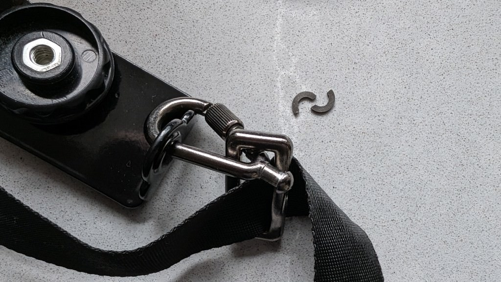
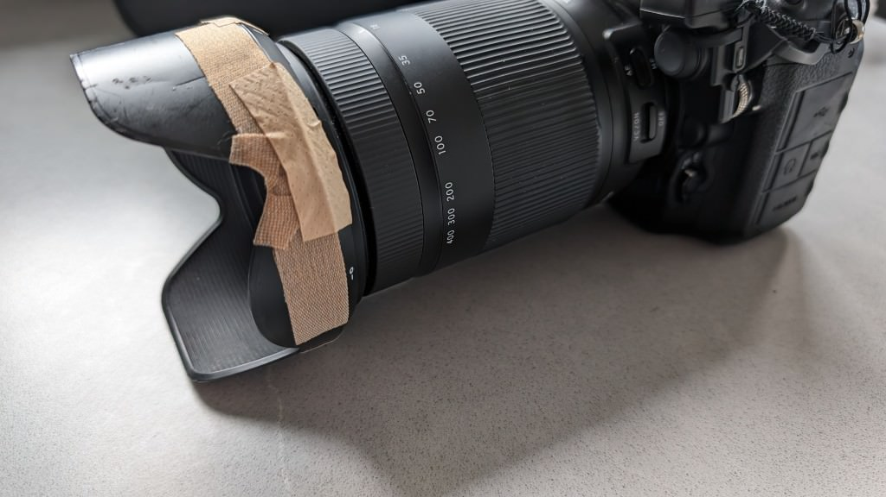

A few months ago I bought a new camera strap, which seemed to be a bit easier to handle than the old one, which had completely twisted after a year, and was also much cheaper. Today, a 1 cent part broke off, which caused the camera to crash onto hard Welsh stones from just under a metre, lens first ... \<insert a few swear words here\>...

Info: The camera is fine, the lens is missing a small but insignificant piece

Now I don't always carry duct tape with me, so my wife helped me out with plasters.

