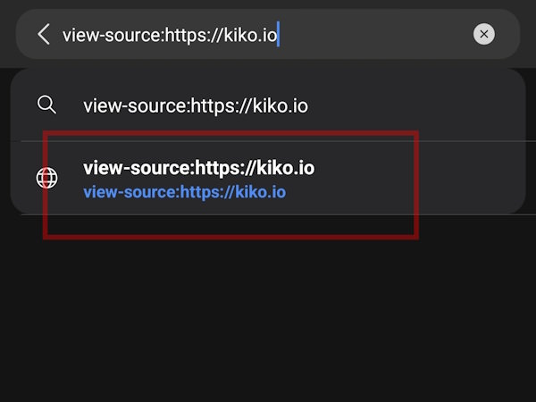

In the #TIL note [View Source on Chrome for Android](/notes/2023/view-source-on-chrome-android/) from 2023 I described how to view a web pages source code by simply prepending `view-source:` to the current URL, but now in 2025 this doesn't seem to work anymore and people have to rely on tools like [HTML Source Viewer](https://trevorfox.com/tools/source-viewer/) ... but that's not true. Sure, simply hitting ENTER doesn't work anymore, but only because the Chromium team changed the default. Just pick the second option and you will see the source code...

#chromium #view-source

